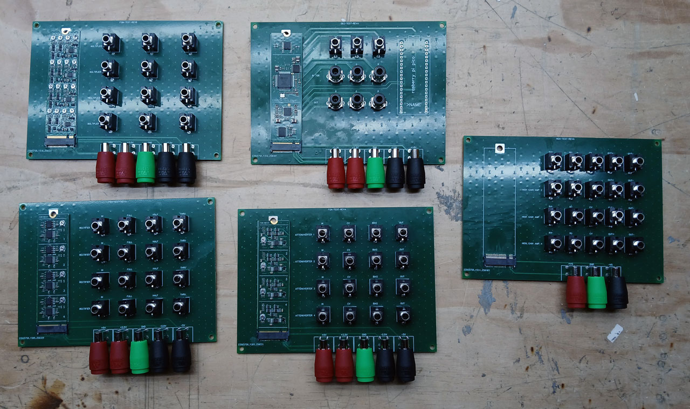
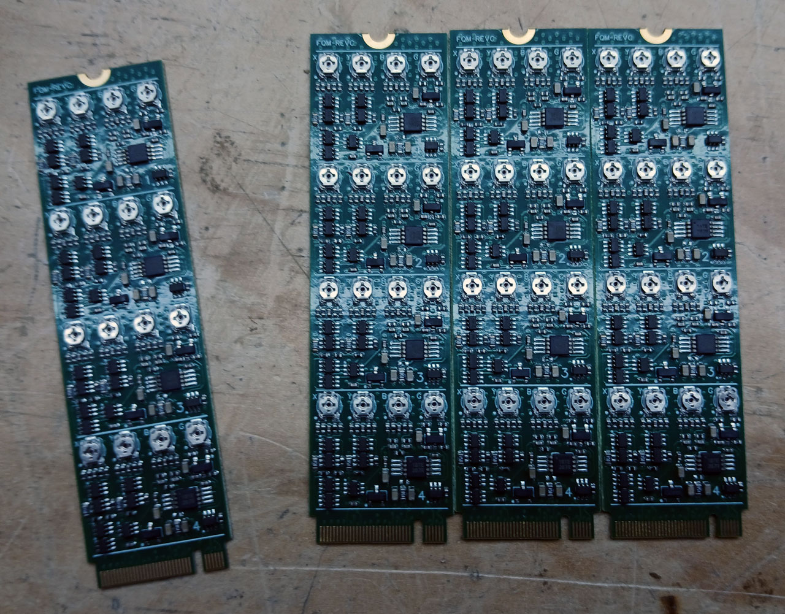

It has been a highly productive past month here at LZX HQ, despite many ups and downs.  We've made a big progress push on Chromagnon with new PCB designs for subassemblies and their test boards, we've got PRM kits in stock, and we've published another round of content for our docs website. 

<!-- truncate -->

The current political climate and new tariffs imposed on imports from China have us heavily concerned for everything we do here.  We received a tax bill in the past month that was several times higher than anything we've seen before. Those of you who have been following our company for a while know that we follow a market price methodology to pricing our products, which means that what you pay for them is a direct product of the hard costs involved in parts and labor -- in other words, if the cost of the parts go up, the price will need to go up at some point as well.  We aren't there yet, as we're hoping the situation will change.  If you've been looking at picking up some modules, it is a good time to get in before that happens.  We will honor all orders and backorders at the current pricing levels.

If you've been following along with Chromagnon, we've been pushing for over a year on a fully integrated single board solution designed to finalize the Chromagnon design so that it can enter production.  We've been stuck at a stasis point on the next revision of that board for a few month, as you all are holding the line without much news.  I've realized that the integrated single board approach has been holding us back from finalizing the design, and that the lost time in sealing the design is costing us more than time spent on alternative approaches -- such as the modular subassemblies we were working on earlier in the project.  We've decided to pick up that thread and make a move toward a new version of the subassemblies, and integrating them into the next revision of the core.  This will ensure that we cut no corners when it comes to precision and stability, even though it will raise our production costs and labor when it comes time for production.  

I'm happy to say that this effort has been a great success -- we've designed, built and validated 5 different submodules and their test boards in the past month.  The test boards allow us to calibrate and test each submodule before installation on the main assembly. 

*Modular subassemblies*

Pictured above you can see:
- FQM-REVC, a quad multiplier submodule. This circuit is an enhanced derivative of the venerable MC1494 multiplier topology, optimized for video transmission and bandwidths.  It has individual trimming points for null, bias and gain. 
- DEC-REVA, a fully encapsulated decoder/encoder submodule designed to transform CVBS and Component video inputs into 1V RGB signals.
- FWR-REVA, a quad rectifier submodule.  This circuit leverages the enhanced performance of our new P series rectifier, and will ensure that Chromagnon's shape generation functions do not produce distortions around the mirror thresholds of diamonds and other shapes.
- FQA-REVA, a quad active attenuverter submodule.  This circuit is a revision of our classic null gap active video attenuverter design.  
- HGA-REVA, a quad high gain clipping amp submodule.  The test board is shown, but the assemblies are missing in this photo.  This design provides high gain amplification of an input signal, with the integrated limiting amplifier clipping the outputs.  It has a few uses, but soft key generation is the most obvious one.  This is a new revision of circuits from Doorway, Staircase/Stairs, and Topogram. 

*A closer look at FQM-REVC*

The best part of these submodules testing well, is that we are much closer to done!! We have one more submodule design in progress, and then the next revision of the Chromagnon Core RevI can be completed -- with most of the circuitry moved to these submodules, the next Chromnagnon core board revision will go fast rather than being another tedious revision of a giant board.  I look forward to providing an update on that in the next update.

Our content designers have been plowing through the massive amounts of documentation required for our new docs website, and we've just published an update that includes baseline content for the remaining Gen3 modules without proper user manuals.  We'll be adding more illustrations and written content to this over time: [module list](/docs/modules/module-list)

After getting held up in customs, we finally have some kits in stock for our Precision Rectifier & Multipler (PRM) module.  This module is a basic ingredient of video synth functions, and the number of functions you can patch with it is a long list.  Read about them on the docs website here: [PRM documentation](/docs/modules/prm)

Times are tough for the whole industry of USA based synth makers right now.  It is with undying gratitude that we thank you for helping us keep the dream alive here at LZX Industries.
