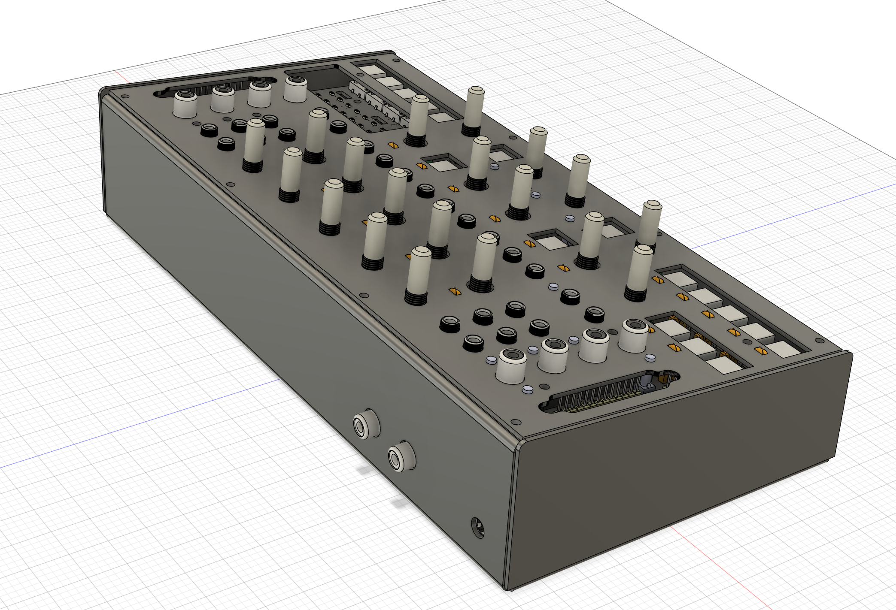

Hello fellow gray hairs. I've aged 55-175 years since my last update.  There is a lot to discuss, and not all of it is bad.

The new tariffs on imports from China started hitting us full force around the time of my last update. For example, in the past with a small batch assembly order under $800 from one of our overseas vendors, we had not been charged any import tariffs.  This meant that outside of the occasional big delivery we could operate as a small business without the tariffs (imposed back in January) strangling us. 

<!-- truncate -->

On April 23rd, logging in to place my usual purchases for PCB assemblies, I see that a tariffs line has been added at checkout for 175% of the order's value. My order was for $284.39 and the additional tariffs charge was $497.69!  This is nearly tripling our primary manufacturing expense. Most of the cost of an average LZX module is the PCB assembly and the video grade components mounted on it.  

This change forced me to suspend multiple active production projects and temporarily disband the workshop team.  Since then I've been trying to do everything I can to figure out alternative strategies for LZX. Thankfully, there are plenty -- the most relevant of which is that we do have an in house SMT assembly machine. On May 14th the tariffs surcharge percentage dropped from 175% to 55% at our external vendor. This difference is enough for us to at least push forward, by only ordering the PCBs and doing all the assembly work here at LZX HQ.

We must assume that we'll be paying a 55% surcharge on any purchasing from China from now on (unless after this 90 day "pause" on tariffs they go up again). For LZX in the short term, the 55% tariff is going to apply directly to PCBs and SMT assembly stencils.  We're going to switch entirely back to in house SMT assembly, which means increased costs of assembly wages and inventory management (but not as much as paying tariffs on these items).  The effect of which is:

- Effective June 1st, we will increase the pricing on all EuroRack modules and EuroRack modular systems by 20%. 
- There may be gaps of availability in some products this year as we pivot to new processes. We will be disabling backorders for any items temporarily going out of production after their next or current batches.
- Pricing on Chromagnon, the Vessel case, cables, accessories, and power related products (like DC Distro) will remain the same.
- You can purchase anything on our webstore at the current pricing until May 31st.  
- The shorter term cashflow really helps us right now, so please do not feel guilty for making purchases before the prices go up.

Amidst the scramble of the past month, I have continued to pursue my efforts to guide Chromagnon in for landing. Part of that is making some careful and informed decisions regarding the reality of manufacturing it smoothly, and how that will integrate into the evolving supply chain equation. Here is what that looks like:

- We're not going to invest in injection mold tooling for Chromagnon's cases and molded parts, and will pursue alternative means of producing these pieces. This will cost a bit more in the long term, as we switch to more expensive processes and domestic vendors, but it will allow us to ease smoothly into fulfillment without hiccups and without sacrificing the quality of the end product.
- The Chromagnon standalone enclosure will be upgraded from injection molded part to a single piece sheet metal design.  There will be a rear chicklet PCB that adapts the modular style power and sync connectors to the rear of the case.  Here's a look at it:
    
    *Rendering of sheet metal boat part for Chromagnon*
- From the launch date, there will be separate SKUs and prices for the module alone, or the module in its standalone enclosure.  Everyone with a current preorder gets the enclosure as expected. 
- We will use our existing Gen3 parts and suitable off the shelf options for control knobs, rather than custom molded parts, in order to guarantee proper fit and no production flow issues.
- Custom button caps and the LED light grid will be combined into a single piece sprue that will be 3D printed by an industrial service in production quality resins. Check out the last posts about knobs early 2024 if you want to see what that looks like.
- We won't be adding a cooling fan or a big rear panel. The architecture of the core board is changing away from a big integrated FPGA to testable submodules using FPGAs that are lower cost and don't require any cooling.  This means Chromagnon as a module will maintain the same mounting depth as other Gen3 modules.
- We will be launching Chromagnon fulfillment simultaneously with a new device that can work with Chromagnon as a companion, and offers a unique standalone feature set.  This is something we've had in development since the release of Scrolls, and it's something we've mentioned in the past, but we'll save any spoilers for later this Summer. In any case, it will be Chromagnon's co-pilot in helping initiate fulfillment. Our strategy involves these two products sharing similar production lines, so that sales of the new product will help us ship Chromagnons faster.

Having been forced to make the above decisions, I am in a better position to be able to wrap up the Chromagnon core board project -- I'll write to you again when that job is done, and when I can show you a photo of the new enclosure piece, toward the end of May. I believe we have a clear path to launching Chromagnon fulfillment this Summer, and despite recent obstacles, this makes me very happy. 

