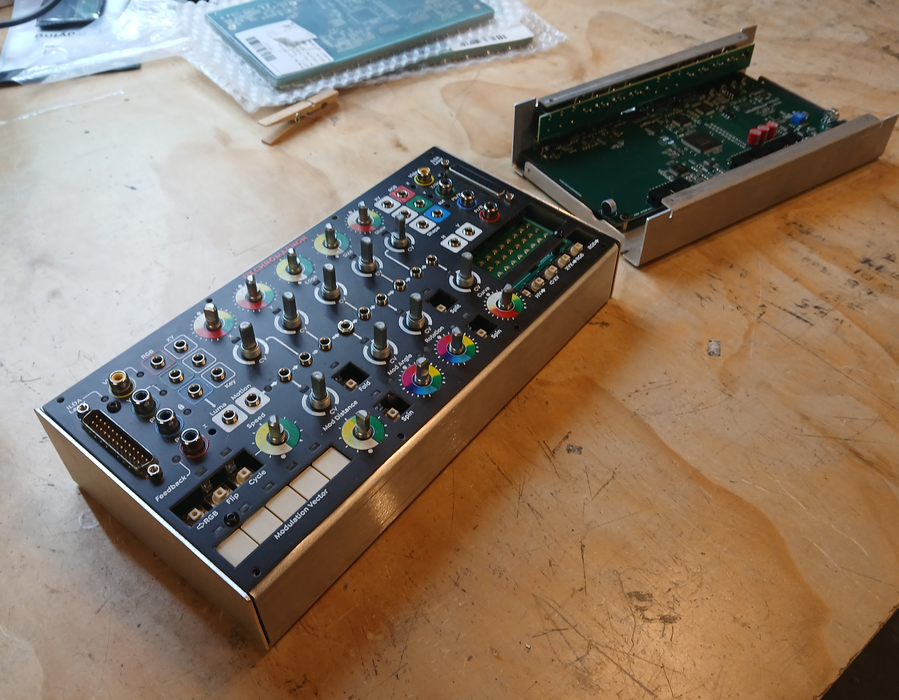

A quick update as we wrap up May. Pricing revisions for all modules and modular systems go into effect tomorrow, June 1st.

<!-- truncate -->

Sheet metal parts for Chromagnon and its companion project are looking great! We're revising and preparing initial production orders.

The current focus is on software/hardware testing and revisions to the PCB assemblies.  We've been stuck here for a while, on Chromagnon, but are now making strides.  The outcome of this phase will be ordering the revised Chromagnon Core PCB, and the focus right now is on eliminating any variables that might compromise this next version's viability for immediate production.  That comes in the form of writing software driver tests for new parts we are using, further testing of the subassemblies we've developed, optimizing parts selections for cost and supply chain variance, PCB layout revisions, and so forth.   

At some point tomorrow I'll update the webstore pricing -- if you place an order before then, the price you paid at checkout will be honored.  

Thank you all so much for your orders placed over the past two weeks, and the kind words of support as well.  
