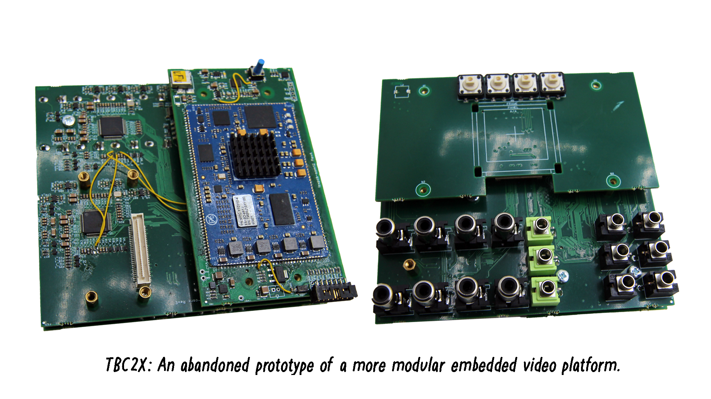
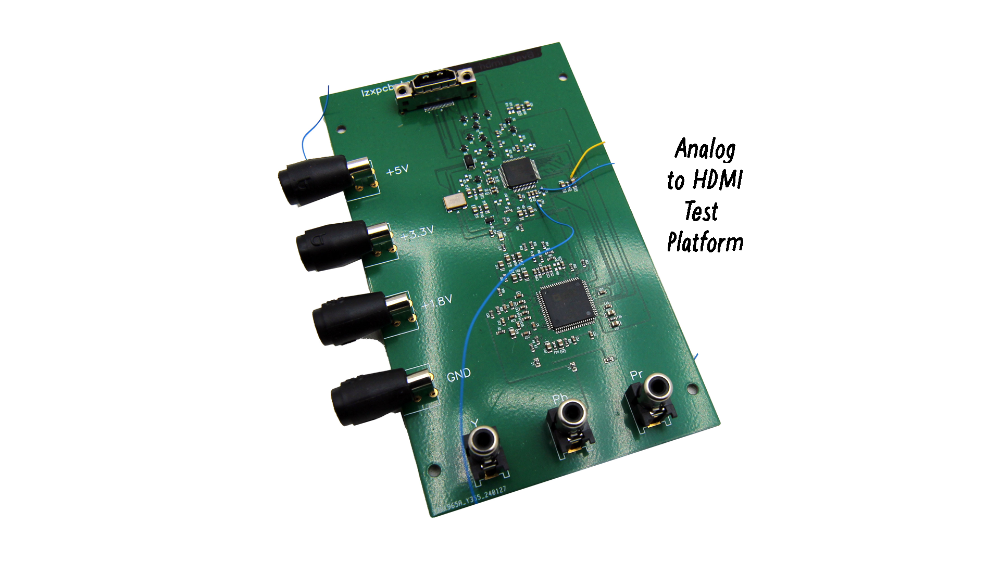
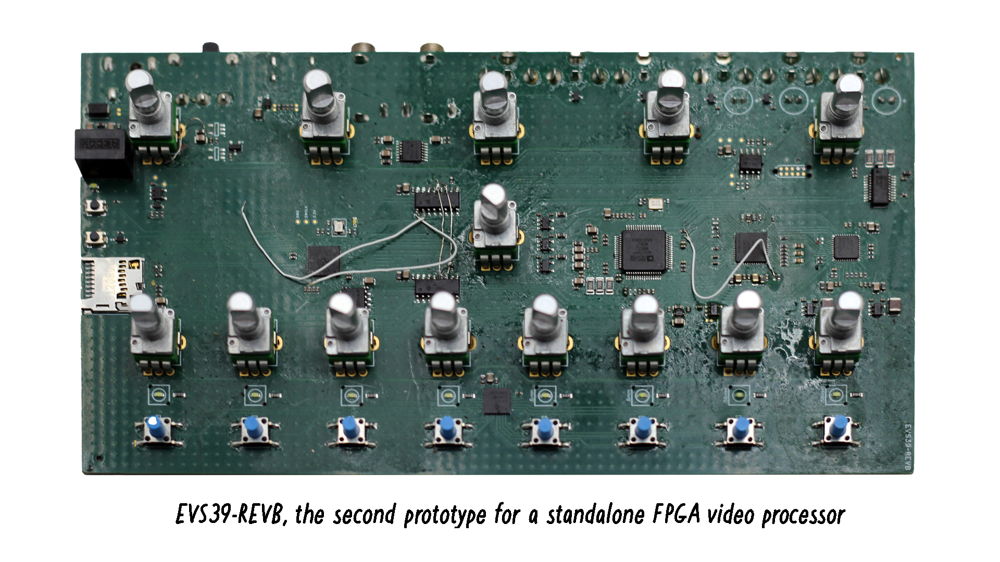
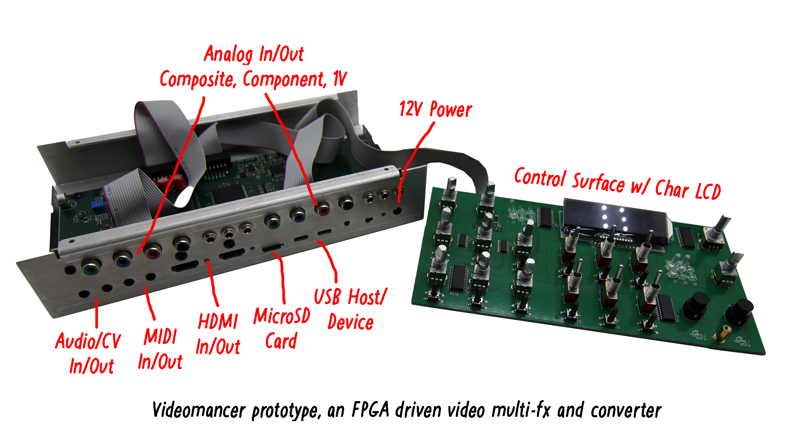

Hello eyeball friends -- I'm taking a break from an intense development sprint to say thank you for your support and patience over the past month, as we shift activities and processes in response to the tariffs on most of the parts we use in production. We have the in house SMT machine running the past couple weeks and are making headway on your recent backorders.

<!-- truncate -->

I've alluded to a plan unfolding regarding Chromagnon and a new companion product that will launch alongside it this year, after some revisions which synergize the embedded digital systems used on both. Our previous plan was _ship unit one and then work out the production details_ and now it has become _ship the first 100 units alongside the first 100 units of the new product._ If things go according to plan, this twin effort will bring the business back into good shape, after suffering some tumultuous years with Chromagnon's tardiness and the lack of our more popular standalone products in the catalog, like Vidiot and Memory Palace. The shared embedded infrastructure is what I've been working on all Summer so far, on top of coordinating more production in house.

I've prepared a slideshow below.

This is the Chromagnon Core, the board I've been working on since its major revision in early 2024. With what you see here, the new analog submodules we discussed earlier this year, and the embedded system project -- we have all the pieces to the puzzle validated and optimized. This board is getting changes integrated and the parts list is undergoing a detailed review. The date at which this is all ready might be variable by several weeks, but becomes easier to estimate as I get closer.

We have been working for years on more modular embedded systems for FPGA video processing, and that's the focus of the companion product. which we have named Videomancer. Here are some photos leading up to where we are with it.

This was the first attempt after TBC2 at making the platform more modular, from around 2022 -- it runs the TBC2 firmware, but was never developed beyond that. Instead we realized HDMI IO and availability as a standalone product would be necessary for this next step.

This was our first test board for a minimal system designed to convert Analog signals to HDMI. I did not get very far with it, but enough to lead into the next step.

I couldn't find the first EVS39-REVA board to show you, but here is the second revision of it -- a standalone video processor with minimal IO.

This led us to what is now production ready hardware for Videomancer in it's latest prototype. After validating all of the circuits are working properly, the system on Videomancer's core board is being integrated on the Chromagnon core, replacing the previous Zynq SoC based platform. This means both devices will be able to run off of a shared firmware infrastructure -- and all of that is looking beautiful.

As the Summer moves on, we'd love to hear more from you about your current and ongoing video art projects. E-mail us or hang out with us in social media and let us know what you're working on!

Hopefully you can make it to [Video Sync in Portland, OR on Aug 15th-17th](https://videosync.xyz/portland2025)? I will be giving a talk on my journey to developing the set of analog operators for video synthesis used in P-Series.

Love and light,
Lars
