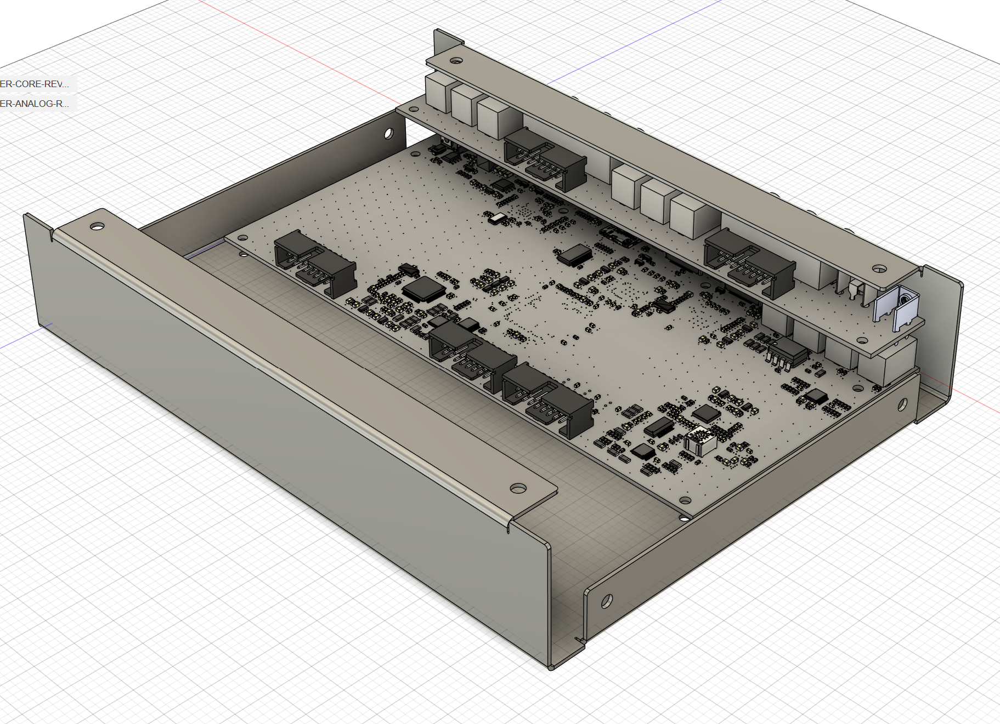
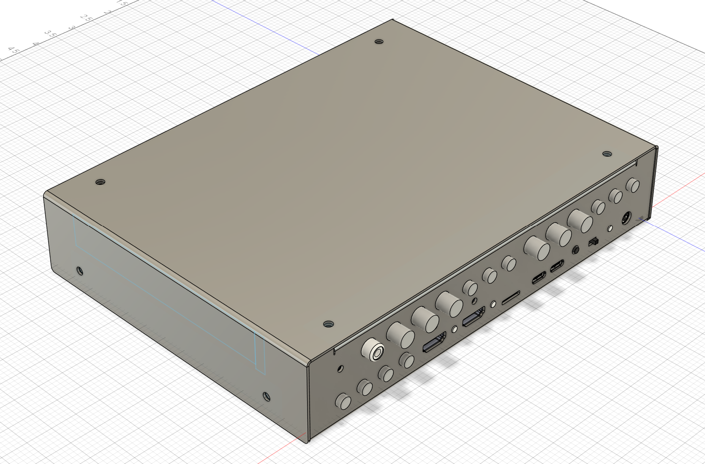
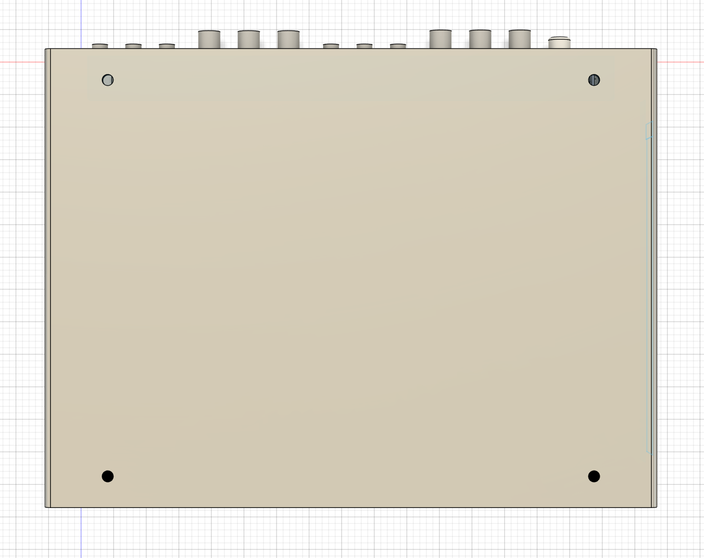
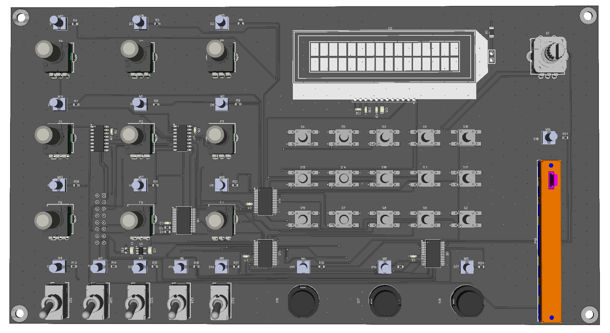
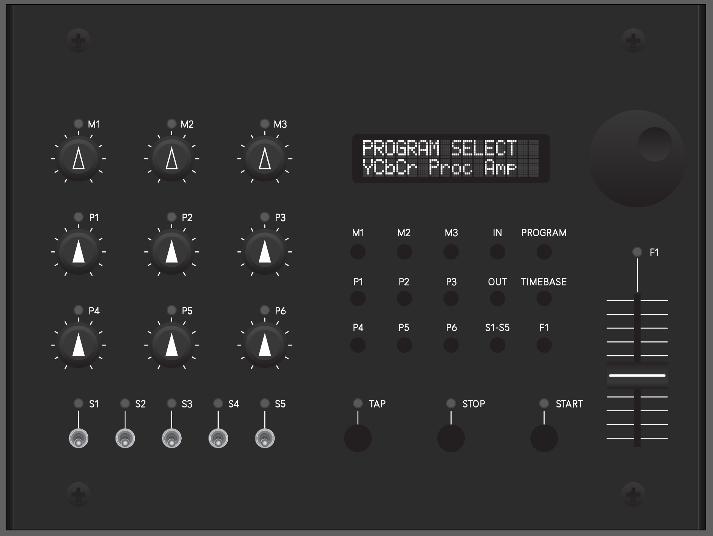

We had a wonderful time at Video Sync 2025 here in Portland, OR earlier this month. Our endless thanks to all of the organizers and volunteers involved in the event! 

<!-- 

 -->

What's up next for LZX? This year has required some massive juggling of our priorities in response to the fluctuating new tariffs, which have effectively demolished our plans going into this year. We were hoping to be shipping Chromagnon by the end of the Summer, but have spent most of the past few months scrambling to figure out how we are going to continue making our products. We have been doing a lot of assessment and planning in August, and despite it all, we remain optimistic about the road ahead. Here is the top level plan as it currently stands.

<!-- truncate -->

*Going into September,* we are finishing a large number of in house production projects, and will be caught up on backorders made over the Summer.

*By the end of September,* our new multi-effects console, Videomancer, will be in production.  During this time we will be polishing the firmware release for Videomancer while also revising Chromagnon hardware to implement new circuits that were designed and validated for Videomancer.  This Chromagnon redesign is essential, as the new tariffs made our previously planned approach impossible. 

*By the end of October,* we will be shipping Videomancer units.  Sales will initially be limited to whatever we have been able to build or already have in production.  By your request, Chromagnon pre-order customers will be e-mailed a code to allow early access to purchases of Videomancer a few days before the public launch date.

*In early November,* we will be validating and writing firmware for the revised Chromagnon hardware.  We plan to share a lot of media as we go through this phase.

*By the end of December,* we expect to have the redesigned build of Chromagnon ready to go into assembly and fulfillment in 2026.

*How fast will Chromagnon fulfillment happen?*  By the time we hit the hardware/firmware milestones mentioned above, we will be able to assess our position on this better.  But there are two ways we expect it could go.  If we are doing strongly after the sales season, we will build Chromagnon in large batches, outsourcing extra help, and hoping to ship all orders in 1-3 waves of shipments.  If that is not possible, we will be integrating Chromagnon into our existing production workflows and start making monthly shipments of a variable number of units dependent on our logistical constraints at the time. With the global economy in flux right now, we don't have a way to forecast this accurately.  This may be a year without many video synthesizers under the tree, just due to the general instability of the global market right now.

Here are a few images to share from Videomancer development.  This must be considered a behind-the-scenes slideshow, so please don't take anything you see here as a final answer.

<!-- 

 -->

<!-- 
 -->

Thanks for reading, and I am excited to check in with you all again in September.
