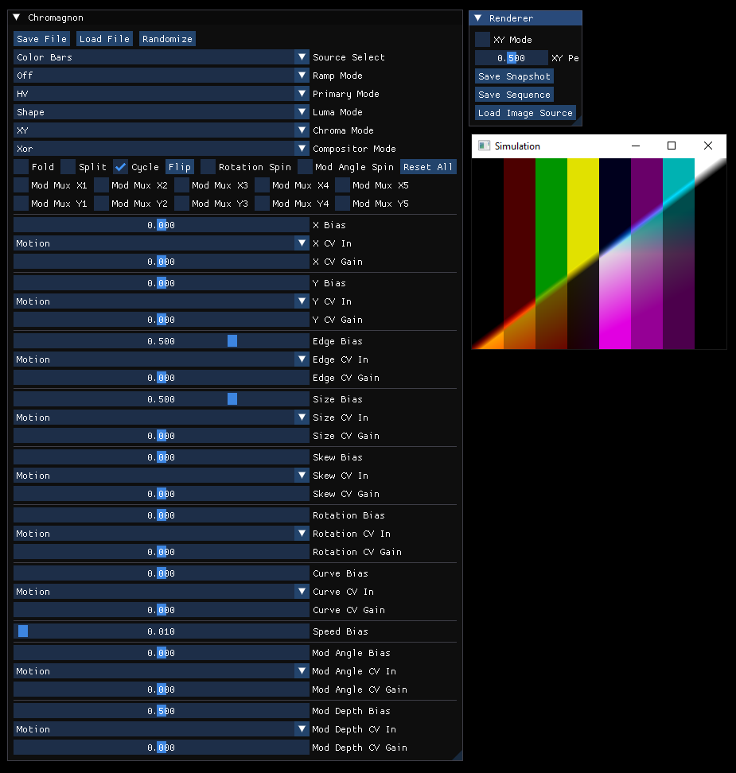

Hi everyone! As promised, I've made my Chromagnon Simulator application available for download. This was a tool created for design reference during development of the hardware, so it is not very polished or useful beyond getting a preview of the instrument's functionality -- which I hope you will enjoy! The MacOS build has some issues, but can be made to work with the installation instructions below.

<!--truncate-->



## Download Links

- **Windows**: [chromagnon-simulator-windows-portable.zip](/zip/apps/chromagnon-simulator-windows-portable.zip)
- **MacOS**: [chromagnon-simulator-macos-portable.zip](/zip/apps/chromagnon-simulator-macos-portable.zip)

## Windows Installation

Simply download the appropriate zip file for your platform, extract it, and run the application. No installation required - these are portable versions that run directly from the extracted folder. 

## MacOS Installation

There are some issues with the MacOS build, but our user Adam was able to get it to work. 

- Download and extract “chromagnon-simulator-macos-portable.zip”
- Open up the extracted “Chromagnon Simulator-0.1.0 Darwin” folder
- Open up the “bin” folder
- Drag the “simulator-chromagnon.app” into your “Applications” folder
- Navigate to your “Applications” folder, right click “simulator-chromagnon.app”, and select “Show Package Contents”
- Open up the “Contents” folder
- Leave this folder open, and open up a separate file explorer window and navigate back to the original extracted “Chromagnon Simulator-0.1.0 Darwin” folder
- Right click the “simulator-chromagnon.app” and select “Show Package Contents”
- Open up the “Contents” folder
- Drag the “Frameworks” folder into the “Contents” folder opened up in step 6
- [Skip if you already have homebrew installed] Open Terminal and paste the following command to install homebrew then hit ENTER:

```bash
/bin/bash -c "$(curl -fsSL https://raw.githubusercontent.com/Homebrew/install/HEAD/install.sh)"
```

- When prompted, hit ENTER to continue the installation of homebrew
- In terminal enter the following command to install SMFL2.6 and hit ENTER:

```bash
brew install sfml@2
```

- In terminal enter the following command to remove MacOS security restrictions from the simulator app and hit ENTER:

```bash
sudo xattr -rd com.apple.quarantine /Applications/simulator-chromagnon.app
```

- In terminal, enter the following command to point the simulator to the correct library files and hit ENTER:

```bash
cd /Applications/simulator-chromagnon.app/Contents/Frameworks

rm libsfml-*.dylib

ln -s /opt/homebrew/opt/sfml@2/lib/libsfml-graphics.2.6.dylib libsfml-graphics.2.6.dylib

ln -s /opt/homebrew/opt/sfml@2/lib/libsfml-window.2.6.dylib libsfml-window.2.6.dylib

ln -s /opt/homebrew/opt/sfml@2/lib/libsfml-system.2.6.dylib libsfml-system.2.6.dylib

ln -s /opt/homebrew/opt/sfml@2/lib/libsfml-audio.2.6.dylib libsfml-audio.2.6.dylib

ln -s /opt/homebrew/opt/sfml@2/lib/libsfml-network.2.6.dylib libsfml-network.2.6.dylib
```

- You should now be able to navigate to your “Applications” folder and open “simulator-chromagnon.app” as normal
