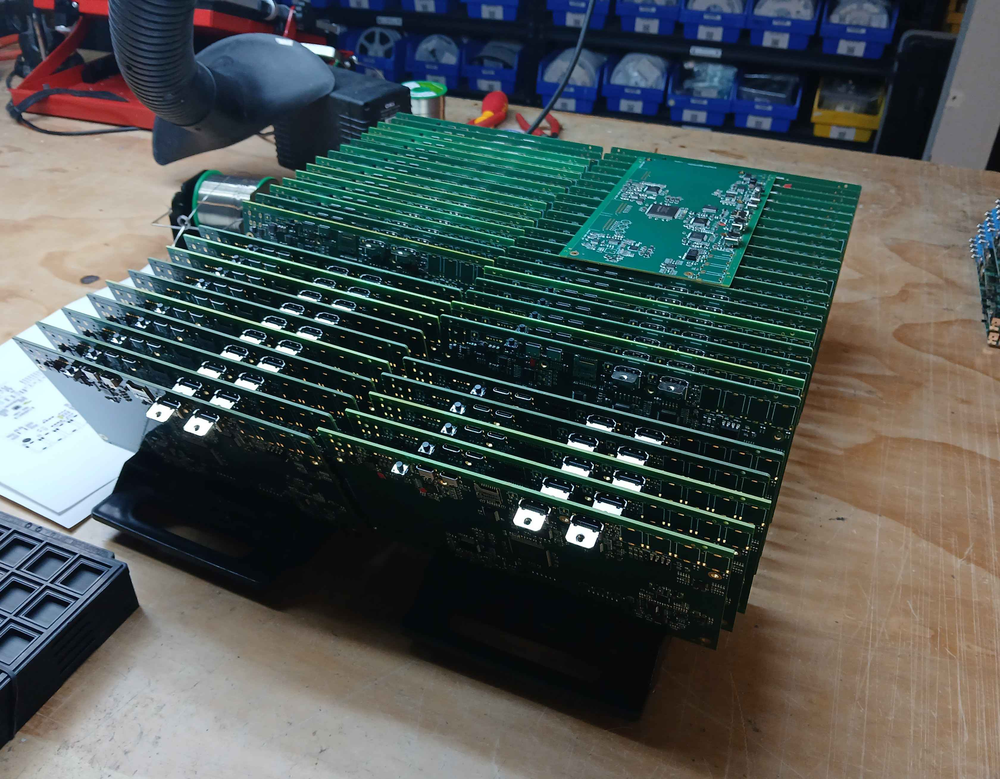
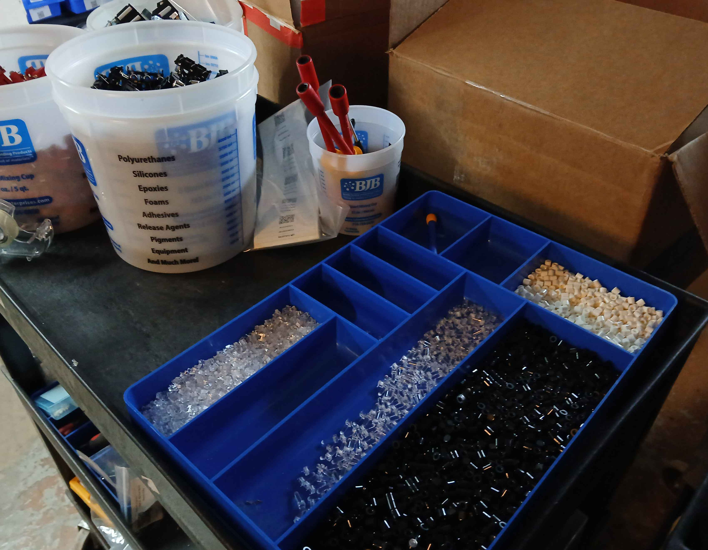
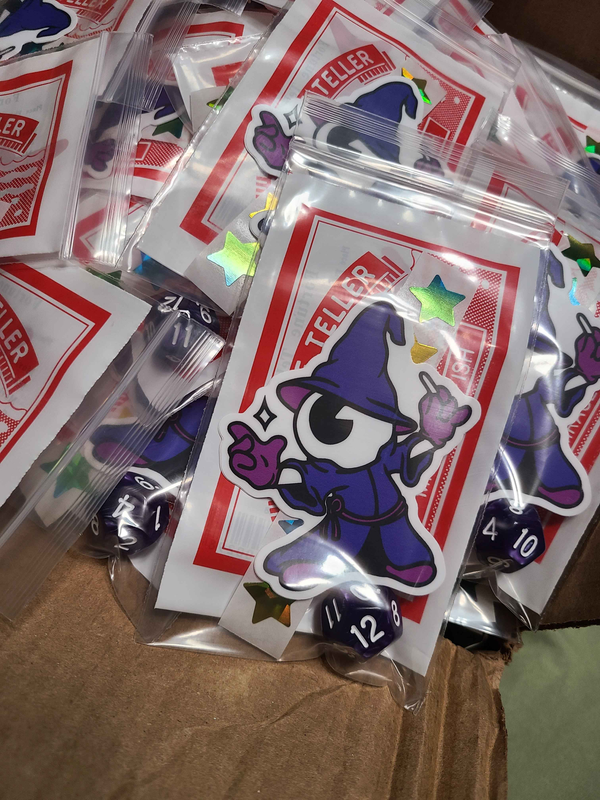
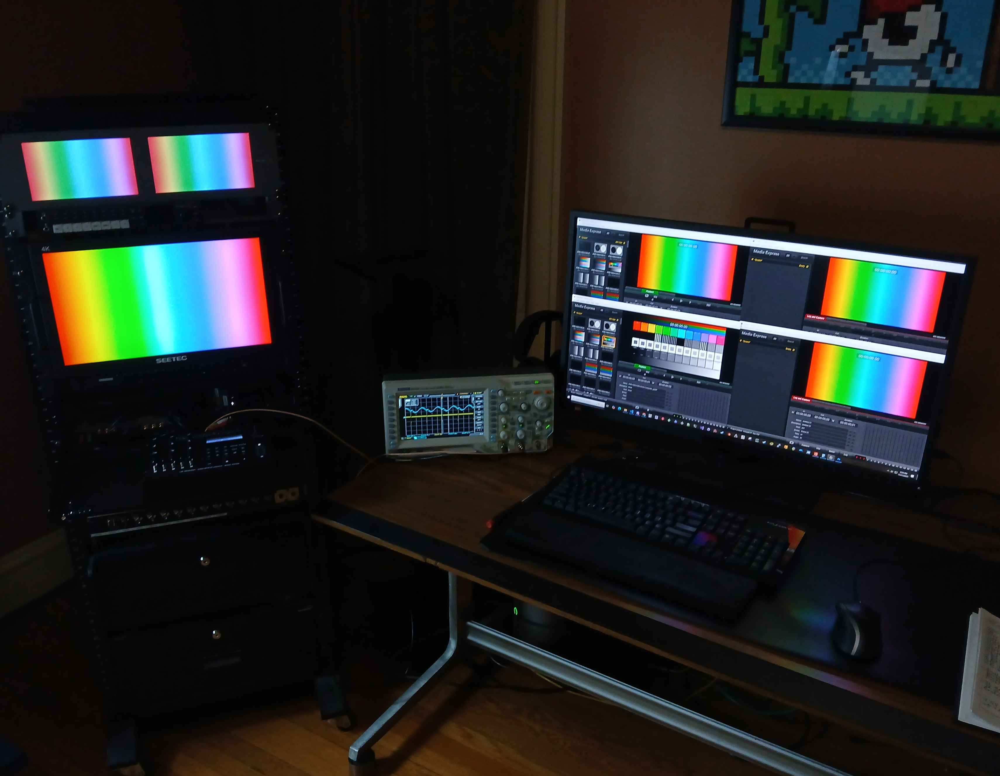

Back in August, we laid out our plans for finishing 2025 and getting into 2026. Here's how it all turned out.

<!--truncate-->

## Videomancer

Videomancer is shipping now. Batches 1 and 2 (160 units total) have shipped, and Batch 3 (the final 80 units) is shipping over the next two weeks. Orders are currently closed but will reopen in January 2026 with new stock ready to ship.

Production and shipping have gone very well. We've partnered with a new contract assembly house that will help us keep up with demand going forward.

Firmware is in beta, with a major release planned for January that fixes bugs and adds new features and programs.

## Chromagnon

Chromagnon progress stretched longer than expected in 2025, mainly because Videomancer's success kept me focused on production and shipping through October and November. Currently I'm wrapping up the next Videomancer firmware release, then transitioning to Chromagnon hardware revisions in January.

A realistic timeline for Chromagnon production is toward the end of Q1 2026. The good news: Videomancer's success means we have no barriers to completing Chromagnon and moving into production. We'll integrate Chromagnon assembly orders with our third-party contractor, using the same large-batch approach that worked well for Videomancer - batches of 80-120 units.

If you'd like to preview Chromagnon's functionality, check out the [Chromagnon Simulator downloads](/blog/chromagnon-simulator-downloads) we released earlier this month.

## Looking Back, Looking Forward

2025 started with a strong sprint on Chromagnon's analog design. Then tariffs and rising component costs threw a monkey wrench in our plans. Shelving exciting analog work to address the production crisis was disappointing, but necessary.

Videomancer turned out to be a fascinating project - hot-swappable FPGA firmware, lean and affordable FPGA video processing architecture, and our first open source releases with the [Videomancer SDK](https://github.com/lzxindustries/videomancer-sdk).

2026 will be even more exciting. I plan to spend most of the year on Chromagnon and iterating Videomancer's codebase and programs. We may start work on Memory Palace 2 before year's end, and I'd like to squeeze in some new analog module designs that have been brewing.

Thanks for sticking with us through all the twists and turns. See you in 2026.
