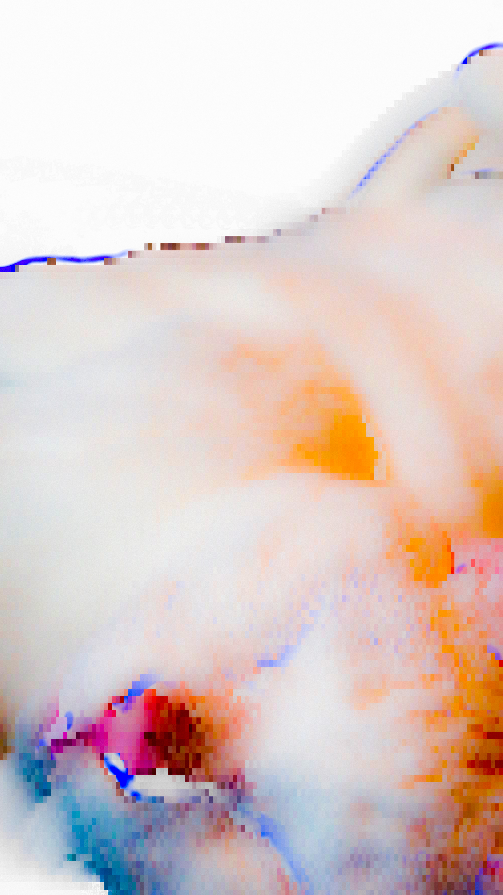
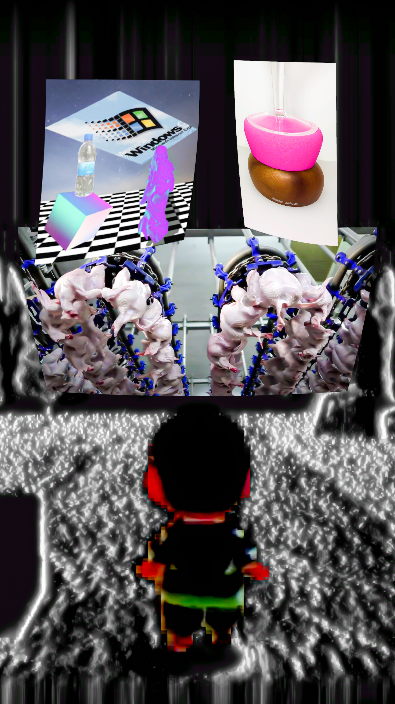

Our first artist feature! Vincent Bergeron ([@Vincentbrgr](https://vincentbergeron.fr)) is a multimedia visual conceptualist whose work bridges drawing, photography, and digital processing to explore identity, perception, and time.

<!--truncate-->

_Video — CORPUS CHEZsoi ([view project](https://vincentbergeron.fr/accueil/realisations/chez-soi/dedansv/))_

## Process

Starting with a drawing, capturing it with photography, then mutating an image to give it life through digital processing — "I analyze the data contained in an image: syntactically (pixel coordinates, chrominance, luminance, segmentation) and semantically (foreground, landscape, object, face, etc.). I then cut the image into parts, to which I give independent evolutionary properties depending on what I want to express," he explains.

_Video — dansLeRêveDeQuelqu'unD'Autre ([view project](https://vincentbergeron.fr/hors-champ/danslerevedequelquundautre/))_

## Perspective & Perception

Vincent was always interested in the construction of identity through visual arts. "One of the concepts that intrigued me was the evolution of points of view, the fact that they were in motion, that the concept of time gave depth and complexity to a perspective." This led him to the world of video — something always in motion, a representation of time. In his research, he worked with cognitive scientist Bilge Sayim to learn the complexities of the brain and how it reacts to stimuli. "By segmenting high and low luminance in a 2D image signal and using displacement, I recreate the parallax clue that the brain interprets as 3D. It's glitchy and difficult to control, but it works!" he admits. These concepts are the tools he uses to drive his visual creations.

_Video — motionless movement_

## Current Work

Vincent Bergeron is currently working on visuals for three short films in collaboration with fellow artists:

- **"Vorace"** — in collaboration with sound artist Léopold Cordier, aims to illustrate the Canut revolt (one of the first worker revolts) in a memorial lens through a contemporary view of struggle through abstract memory.

- **"dansLesSouts"** — in collaboration with sound artist Samy Bérard, encourages escape from a capitalist world through 3D images and a spatialization system, giving it potential for a compelling live sensory experience.

- **"ThePaleBlueDot"** — in collaboration with sound artist "Gil.Barte," penetrates the control and safety of "home" by bringing the outside in via technology, thus contrasting the physical comfort of being somewhere safe with the endless stream of consciousness that is the internet and social media.

_Video — ThePaleBlueDot ([view project](https://vincentbergeron.fr/recherches/parallaxe/))_

Vincent looks forward to getting his hands on Chromagnon sometime soon, to further equip his creative toolshed and offer live performances.

**Explore more of Vincent's work at [vincentbergeron.fr](https://vincentbergeron.fr)**
