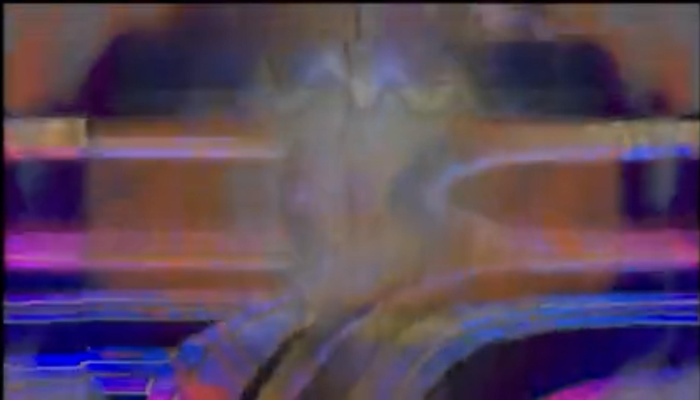
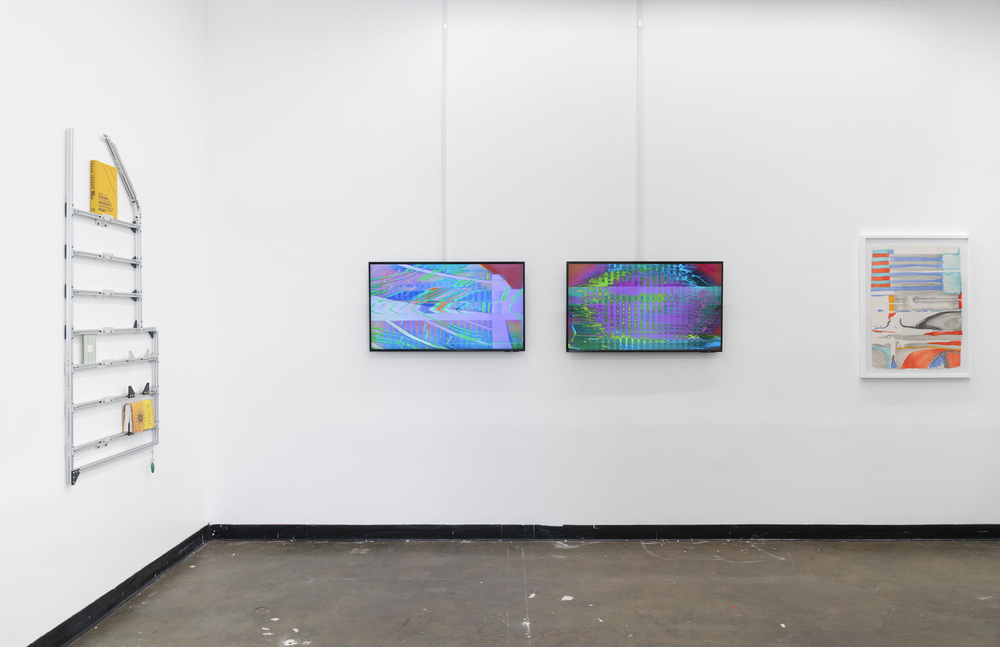
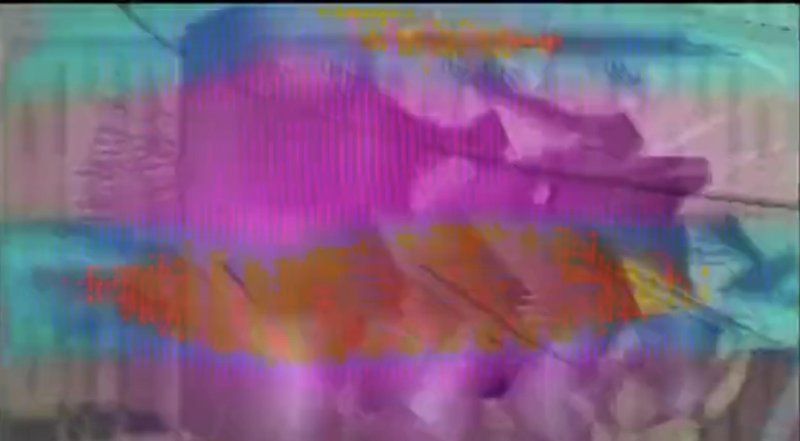
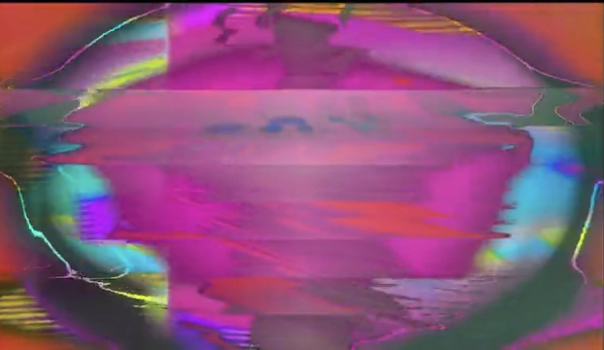
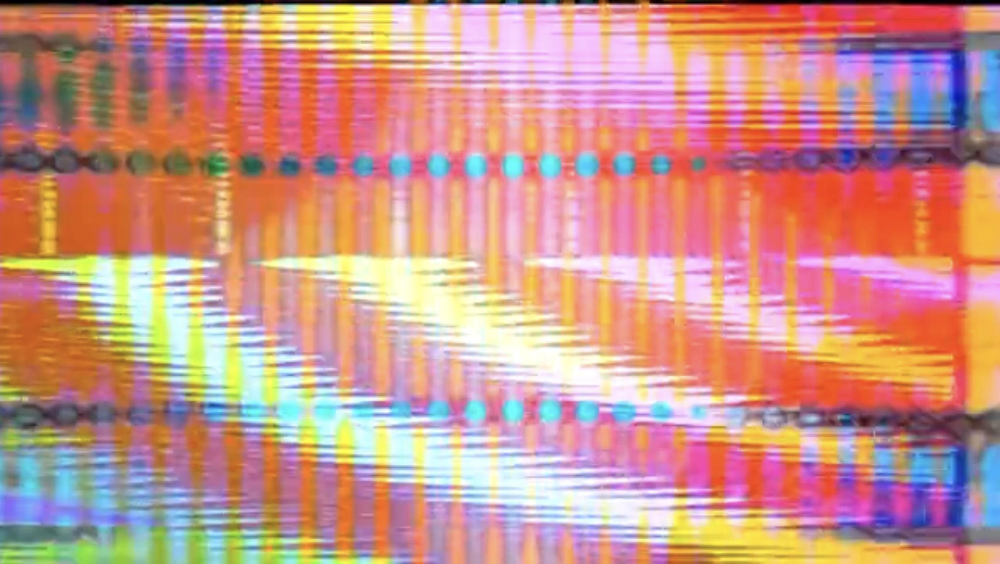
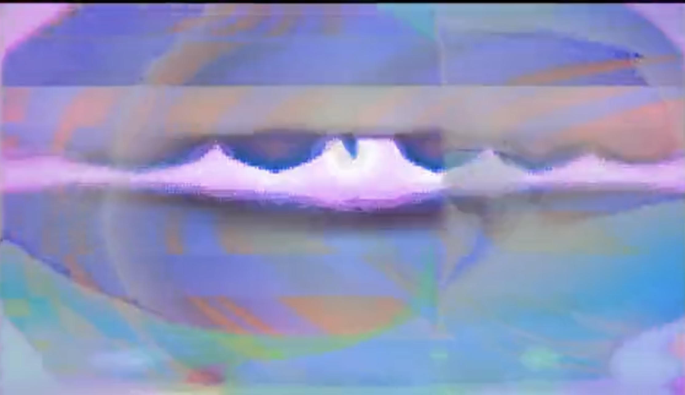
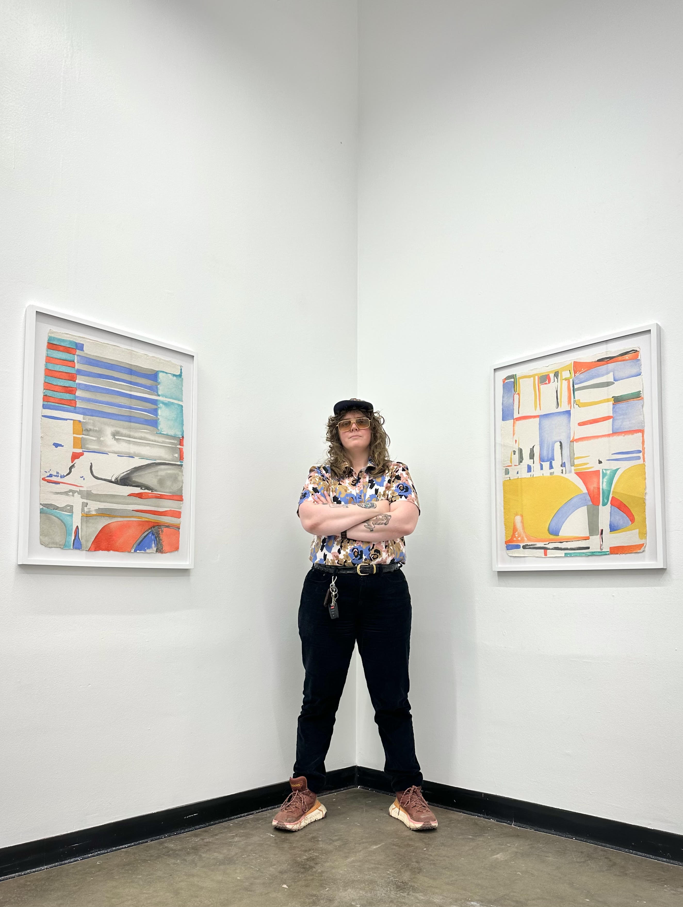

Lauren Klotzman is a multi-medium conceptualist who conducts an anti-disciplinary philosophy in their creative process. "Klotzman is an instrumentalist, operating an analog modular video synthesizer to create 'video paintings' via electricity." Klotzman views time and energy as one, composing life and therefore the art that flows through it.

<!--truncate-->

## Background

Based in Texas, Klotzman grew up wanting to pursue animation. However, rather than the fluidity and non-linear nature of cartooning, they found themself more interested in complex shapes and angular designs. "My drawings were pretty firmly rooted in geometric abstraction," they'd admit. After being told by a professor that the art they wished to create was outside the scope of traditional animation courses, Lauren acknowledged that animation wasn't the avenue that accurately matched their creative vision.

## Process

Rather than describing it as a "creative process," Klotzman views the creation of their process as an intuitive conception of many energy forms given visual form. "That can be as literal as the electricity which courses through the system or as woo-woo as energies which are more easily described as being within the realm of the spiritual." Lauren doesn't go into creating a patch with a suspected outcome; they let art flow naturally. "Sometimes, I am not even looking at a video monitor while I am patching: it's more of a contemplative practice or a meditation than anything else," they admit. Simply put, they let the cables land where they want to and the patch becomes organically unique.

## Current Work

Klotzman is currently working on setting up a new studio space, which has halted the synthesis part of their creative toolshed for the time being. "I've taken time to work in older ways that have less to do with synthesis, but I am very excited to eventually finalize a new setup which will be conducive to creating works which are even longer and more complicated than what I have previously created," they're excited to mention. Lauren is looking forward to creating with both their older and newer tools, upcoming shows, and potential collaborations.

