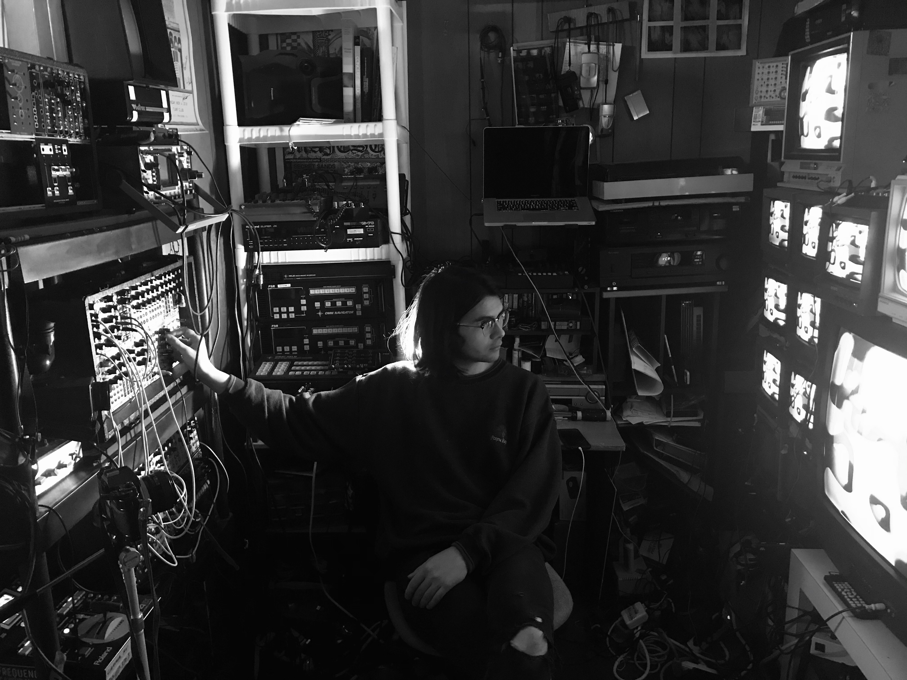
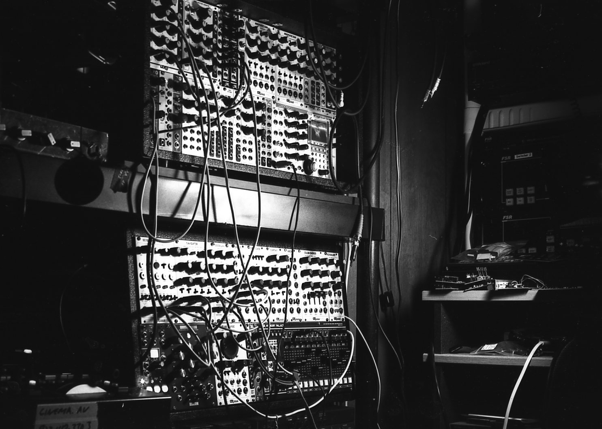
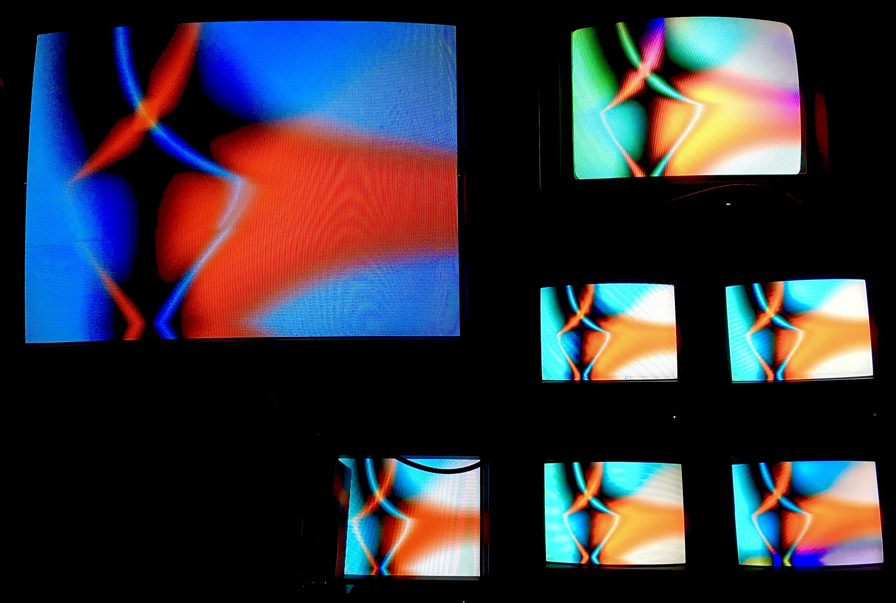
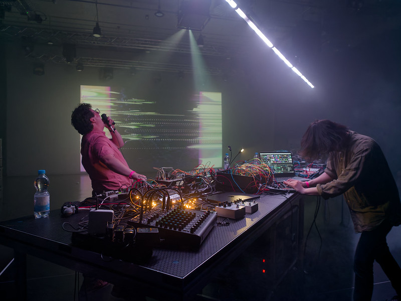

Evan Henry ([@Cinema.AV](https://www.instagram.com/cinema.av)) is both an audio and visual artist who often works with live bands and audio synth creators to make collaborative live shows and performances. He started his journey at Dallas Ambient Music Nights, occasionally performing "some video tape I found at a thrift store, like a National Geographic or Mind's Eye sorta thing." When Brian Tomerlin — his now longtime friend — brought his 5–6ft high CRT setup to a show and performed using various video devices, "I just sat there, most of the night, like I'd often do as a child, just glued to those televisions." Afterward he was hooked, finding any way he could learn, and eventually acquiring his own setup to bring to shows.

<!--truncate-->

## Process

"The setup grew and evolved into a full blown LZX system, talking multiple cases, and then I became known as one of those guys who does 'modular visuals', which apparently is quite a spectacle worth booking." Because of this, he soon began touring and collaborating with various artists. Although his style has evolved, he starts his process by patching on a video system, getting it on a capture card, and following it up with additional patching through Resolume and various tweaking and editing. "I just goof around for a while, capture, maybe post a few snippets online over the course of a couple weeks, and see what sticks."

## Current Work

Henry is currently working on visuals for EBM artist Kontravoid's upcoming European tour, reworking and editing some of his previous work into new and interesting visuals that match the musical elements of the show. "It's always nice to see old pieces mix with new ones for something totally unique and of itself. Much like when I play live for bands and various other projects." Evan is looking forward to working on his next record in collaboration with Kris Baha, upcoming local events, and live performances.

