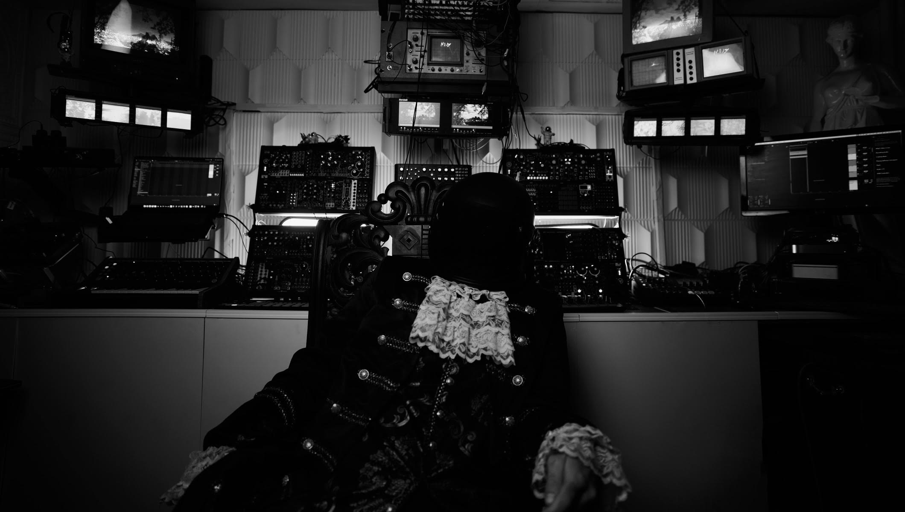
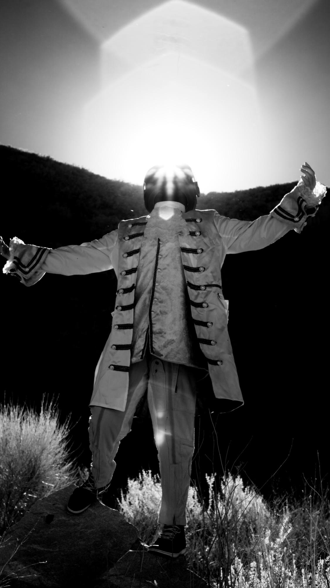
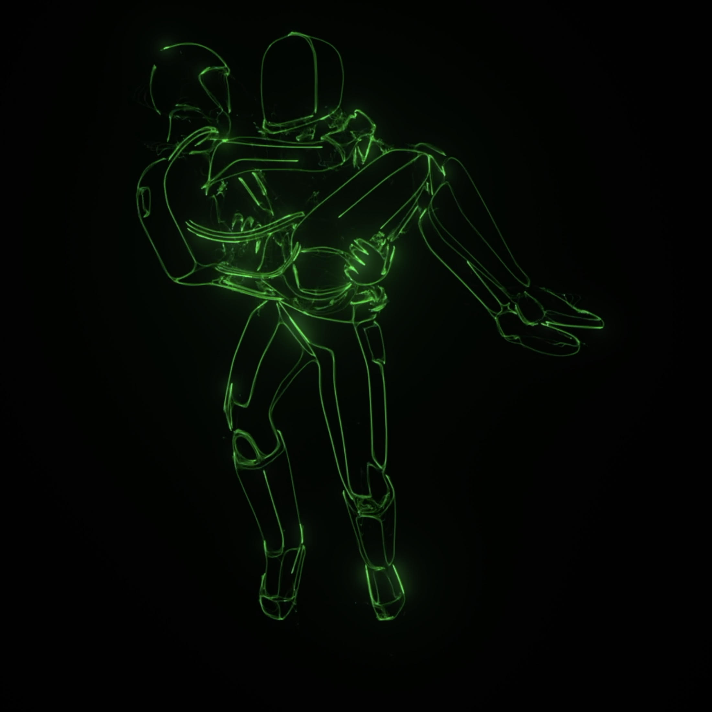
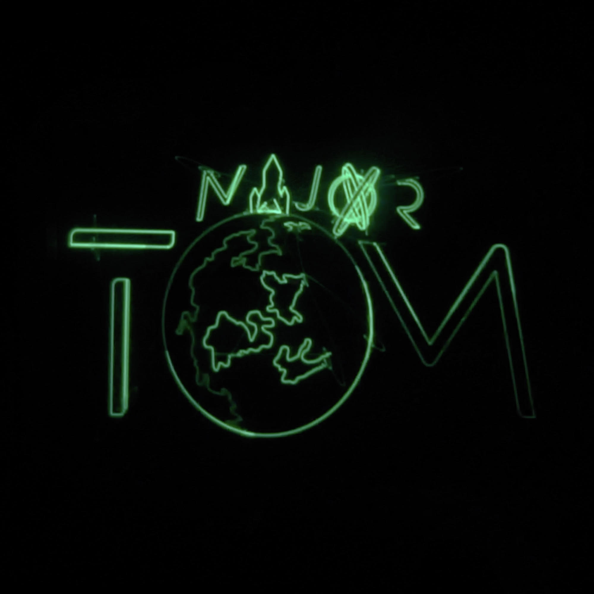
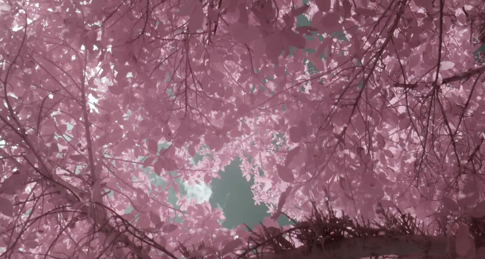
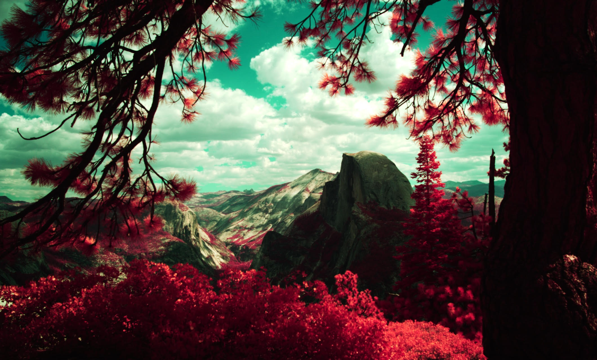

Majxr Tom ([@Majxrtom](https://www.instagram.com/majxrtom)) is an audio-visual artist who began his journey inspired by Richard Wagner's idea of Gesamtkunstwerk — or "total artwork." This philosophy combines all forms of creation, such as writing, music, and visuals to create a synergistic sum, completely unique from its parts. "After many years of working on the craft of my music, I wanted a visual accompaniment to it. The visual and the music always have to speak the same language, and breathe together as if they were a part of the same entity," he explains.

<!--truncate-->

## Process

Although it varies, his artistic process begins with capturing images with infrared photography, writing matching music, patching with Eurorack, and programming final musical touches. "Sometimes I like to just jam out on my Eurorack rig, go to town, and then find and/or create a visual to match the energy. Sometimes it comes out more abstract. Sometimes relaxing. Sometimes driving. Always awesome."

## Themes & Style

He describes the theme of his art to be the manipulation of time, whether that starts with literal slow-motion visuals or audio, or reducing its pitch and playback speed — he loves to combine old tech and new. "It's from the combination of anachronistic artistic mediums, like using modern software like Blender with old analog oscilloscopes. Analog synthesizer gear combined with modern DAW software."

## Current Work

Although he only started sharing his work publicly this year, he is currently working on short form pieces to eventually create an impressive body of work that showcases his art to a potential likeminded audience of fellow creatives. His current goal is to release one piece of work per day this year, showing his commitment to his long-term goals as an artist. Majxr Tom is looking forward to producing new musical pieces into fully fledged ideas and projects, and looks forward to incorporating Chromagnon into his future creations.

