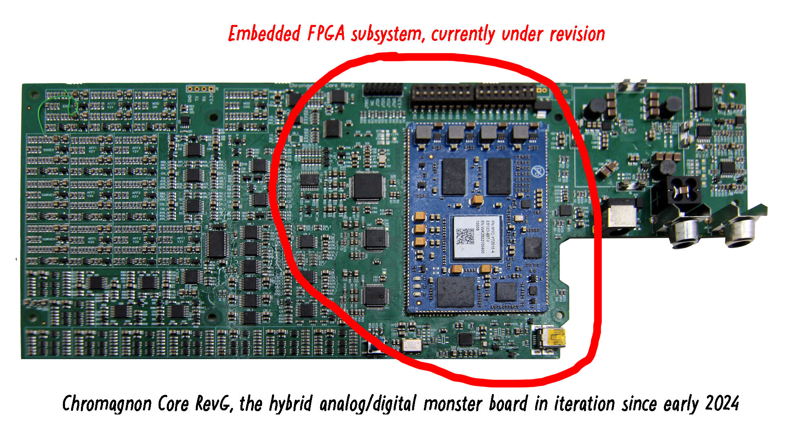
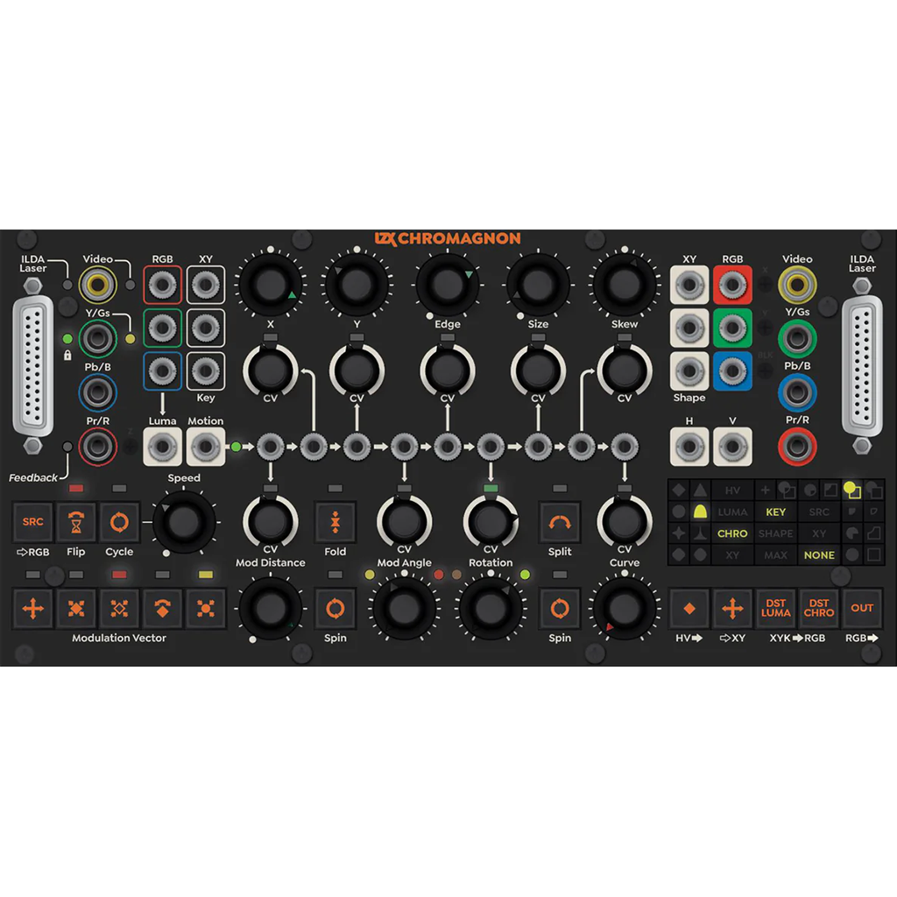
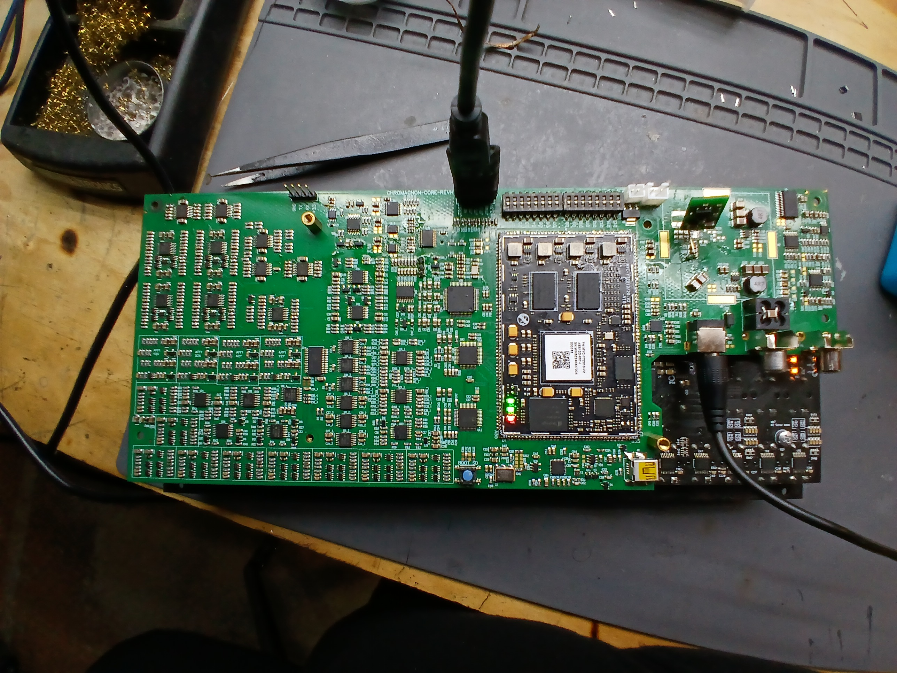
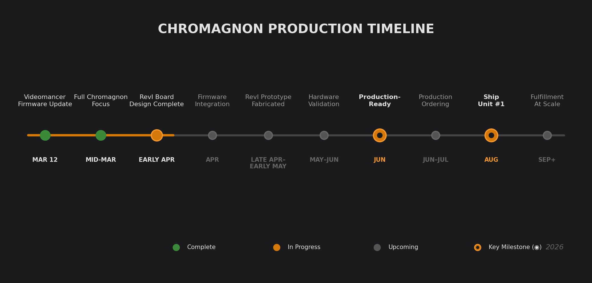

Hello video friends. It's a Thursday here in Portland — spring is creeping in, we've had some colds going around the team, but everyone's in high spirits. It has been too long since I gave you a proper Chromagnon update. The artist features we've been running are close to my heart, but I know what most of you are here for. So here it is: the full production plan, the schedule, and the reasoning behind the decisions that got us here.

<!--truncate-->

In December, I said a potential timeline for Chromagnon production was toward the end of Q1 2026. While we may not be reaching the fulfillment milestone within this quarter, we are making progress.  I owe you a look into a comprehensive plan — one built on what we've recently accomplished, and what our next steps are.

## Where We Are Today

As of this week, my primary focus is a major Videomancer firmware update, launching **March 12th** — 17 new programs plus a round of bug fixes and feature refinements that finalize the platform. This is directly relevant to Chromagnon — the two instruments share the same embedded platform, video I/O architecture, and core firmware library. Most of the time spent on Videomancer's firmware is time invested in Chromagnon's codebase.

The day after that launch, Chromagnon has my full attention. Here's where things stand:

**What's ready:**
- Front panel design, control layout, jack assignments — finalized
- Sheet metal enclosure design — finalized, ready to order
- Button caps, LED light grid, control knobs — finalized designs, ready to order
- Video I/O architecture — validated in production across over 300 shipped Videomancers
- Firmware core (sync generation, genlock, video input, video output, MCU/FPGA communication) — proven in the field
- Desktop configuration app — operational, pending release

**In progress:**
- Chromagnon application firmware (signal processing, UI, control mapping) — built on the shared Videomancer codebase, continuing development

**What's left:**
- RevI core board design revision — integrating the validated Videomancer platform into Chromagnon's hardware layout (2–3 weeks)
- Prototype fabrication and delivery (~2 weeks after design submission)
- Hardware validation — verifying all functions on the new board (2–4 weeks)
- Production ordering and manufacturing lead time (4–6 weeks)

*Chromagnon core board — the foundation of the instrument. The RevI revision will integrate the validated Videomancer platform into this layout.*

## What Changed

Some of you have followed every revision of this project. Others placed a pre-order years ago and just want to know when it ships. Either way, you should understand the major decision we made in 2025, because it's the reason Chromagnon will be a better instrument than what we originally planned.

### The Short Version

In April 2025, tariffs on Chinese PCB assembly surged from baseline rates to 175% overnight. A $284 assembly order became a $782 assembly order. Our entire production plan — which relied on Chinese contract assembly for Chromagnon's massive, 1300+ component circuit board — became financially impossible.

We had three options:
1. **Push through and raise the price** to $3,200+ — breaking our commitment to pre-order customers
2. **Cancel the project** — unthinkable
3. **Redesign with an alternate approach** — the only real choice

We chose door number three. It cost us money and it cost us time. But the redesigned Chromagnon is genuinely better than the original plan.

I also want to address something directly: some of you are frustrated that we developed Videomancer during this period. I understand, and I go into the full reasoning [below](#the-videomancer-connection). The short version is that when tariffs killed our production plan, we needed a new platform, new manufacturing processes, and revenue to fund it all. Videomancer was the answer to those problems. We took out business loans to fund its development — it was not funded by Chromagnon pre-order money.

### What the FPGA Architecture Means for You

Moving the high-speed signal processing to FPGA is an upgrade, not a compromise. Here's what it gives you:

- **True per-pixel processing bandwidth in HD formats** — no analog bandwidth limitations or noise floor concerns at high resolutions
- **Firmware update path** — potential for new processing modes and features over time, delivered via SD card
- **Better signal quality** — the analog I/O buffers and CV input circuits are still high-quality analog hardware, but the processing core operates without the noise and calibration drift inherent in 20+ discrete multiplier stages

## What Has Not Changed

The instrument you ordered is the instrument you're getting. Same 35 jacks — ILDA, composite, component, XY, CV inputs for position, rotation, size, skew, edge, curve, modulation. Same 19 pots and 17 switches for hands-on control. Same complex cartesian vector processor at the core, performing real-time 2D coordinate transforms on video and laser signals (now FPGA-implemented, which actually improves bandwidth and signal quality). Same waveform generators, same video sync generation and genlock, same video input, same ILDA laser I/O with adjustable cutoff filters, same HD support up to 1080i60. Same 52HP width, works in EuroRack or standalone with the included 12V adapter.

And yes — every pre-order will be fulfilled at the price you paid.

*Chromagnon's front panel — 35 jacks, 19 pots, 17 switches. Same layout, same controls, same instrument.*

*Rendering of Chromagnon's sheet metal enclosure — the "boat" design, manufactured domestically in Oregon.*

*Sheet metal parts for Chromagnon — prototype parts in hand.*

## Where Your Pre-Order Investment Stands

You trusted us with your money, and here's where it is.

Your pre-order funds were invested directly into Chromagnon development and production preparation. **All 700 Chromagnon control board assemblies are already built** and sitting in our workshop, ready for integration into finished units. These boards will go through final functional testing as part of the assembly and QC process. The pre-order investment is also absorbed into years of engineering — PCB prototyping, component purchasing, firmware development, and sunk tooling costs from the portions of the design that had to be abandoned.

The money is in the project. It has been for a long time. Projects other than Chromagnon — our modular catalog, and now Videomancer — have been subsidizing Chromagnon's continued development for years. Videomancer development was funded separately through business loans, not from Chromagnon pre-orders. Chromagnon fulfillment has been and remains the company's #1 priority.

*Chromagnon RevH prototype on the workbench.*

*Validated subassembly boards from earlier in development — FQM, DEC, FWR, FQA, HGA.*

## The Schedule

Here is the milestone schedule for Chromagnon production. I'm erring on the cautious side — I'd rather update you that we're ahead of schedule than behind it.

| Milestone | Target | Status |
|---|---|---|
| Videomancer major firmware update (17 new programs, bug fixes, feature refinements) | March 12, 2026 | Final testing |
| Full transition to Chromagnon engineering | Mid-March 2026 | Ready |
| RevI core board design revision complete | Early April 2026 | Not started |
| Firmware integration begins (on existing dev hardware) | April 2026 | — |
| RevI prototype boards fabricated & delivered | Late April–Early May 2026 | — |
| Hardware validation & firmware integration on RevI | May–June 2026 | — |
| **Production-ready milestone** | **June 2026** | — |
| Production order placed & manufacturing | June–July 2026 | — |
| First batch assembly & quality control | August 2026 | — |
| **Ship Unit #1** | **August 2026** | — |
| Pre-order fulfillment begins at scale | September 2026 | — |
| Ongoing fulfillment (monthly batches) | Q3–Q4 2026 | — |

**First batch size:** 50–100 units, scaling with revenue. Our production capability supports 150–200 units/month once we're in full operation, consistent with the batch sizes we've been running for Videomancer.

**Fulfillment order:** Strictly by the sequence your pre-order was received. No exceptions for dealers vs. direct customers.

*Visual overview of the production timeline — milestones from the Videomancer firmware update through fulfillment at scale.*

### What Could Move These Dates

I want to be honest about risk, because even though some things are not to plan -- it only makes bad news worse, if you don't know where things may get off track.

**Medium risk:** The RevI core board requiring more than one revision cycle. Almost every circuit on this board has already been validated in Videomancer's production hardware, which reduces — but doesn't eliminate — the chance of needing a second spin. This is integration work, not new design work, but integration on a board this complex can still surface issues.

**Medium risk:** Production lead times stretching beyond estimates. Global supply chain timelines remain unpredictable. We mitigate this by maintaining relationships with multiple vendors and keeping critical components in stock.

**Ongoing factor:** The pace of fulfillment beyond the first batch depends on revenue. Videomancer sales directly fund Chromagnon production purchases. We have 160 Videomancers in stock and strong demand — this is a factor we can influence, not a hope-and-pray situation.

## How Fulfillment Will Work

Once we hit the Ship Unit #1 milestone:

1. **Pre-orders ship in sequence.** First order placed, first order shipped. The queue is set.
2. **Batch production.** Units ship in batches of 50–100 as they clear quality control. You'll receive a shipping notification with tracking when your unit is on its way.
3. **Customer portal.** We're building a new system at lzxindustries.net where you'll be able to check your queue position, update your shipping address, and opt into notifications. More details on this soon.
4. **Address verification.** Before each batch ships, we'll reach out to confirm your shipping address is current. If you've moved since placing your order, you don't need to do anything right now — we'll contact you before your unit ships. If you'd like to update proactively, email **sales@lzxindustries.net**.

<!-- Customer portal mockup — will be added when the portal is closer to launch -->

## The Videomancer Connection

For those who haven't been following: [Videomancer](https://lzxindustries.net) is an FPGA-based video processing instrument we developed and shipped in 2025. It processes live analog video through hot-swappable programs — effects, compositing modes, colorizers, pattern generators — loaded from SD card.

Videomancer and Chromagnon are **different instruments that share the same foundation.** Videomancer is a video effects console with hands-on controls and loadable programs. Chromagnon is a complex shape and figure synthesizer built for real-time, high-speed voltage-controlled modulation — an entirely different instrument with a different front panel, different signal architecture, and different creative purpose.

I know some of you see it differently: **why did we build a new product when Chromagnon still hasn't shipped?** Fair question, and it deserves a straight answer.

Videomancer took real time and attention in 2025 — I said as much in December, and I'm not going to pretend otherwise. But it wasn't a choice between Videomancer and Chromagnon. It was a choice between Videomancer-then-Chromagnon and neither.

When tariffs hit in April 2025, Chromagnon's production plan was dead. We needed a new platform and manufacturing options. We took out business loans to fund Videomancer — Chromagnon pre-order funds were not used, they were already invested in Chromagnon's control boards and engineering. Videomancer proved out the FPGA video platform, a new assembly process, and the contract assembly relationship that Chromagnon now inherits. Trying to proof all of that out on a $1,600 instrument with 700 pre-orders at risk would have been reckless. And now, Videomancer sales are directly funding Chromagnon production purchases. The two codebases share roughly 80% of their infrastructure — Chromagnon firmware work continued alongside Videomancer throughout 2025.

Without Videomancer, we'd have no tested platform for Chromagnon's redesign, no proven production process, no assembly partner, and no revenue to fund production.

Over 300 Videomancers have shipped since October 2025. Before Videomancer went on public sale on October 31st, over 150 units were sold exclusively to Chromagnon pre-order customers who received early access. The platform works. The production process works. What remains is the Chromagnon-specific integration and validation.

## Frequently Asked Questions

**How long has Chromagnon been in development?**
Too long. The project has gone through multiple major hardware revisions, a complete architectural redesign forced by tariff policy, and has competed for resources with keeping the business operational during an industry-wide sales downturn. None of that changes the fact that it's taken longer than anyone — including me — wanted.

**Did developing Videomancer delay Chromagnon?**
Yes, it took real time in 2025. But it also solved the problems that were blocking Chromagnon — new platform, new production process, revenue. The full reasoning is in [The Videomancer Connection](#the-videomancer-connection) section above.

**Will I receive the same instrument that was originally described?**
Yes. The front panel, controls, jacks, feature set, and user experience are the same. The internal signal processing architecture changed to FPGA-based, which improves signal quality and enables future firmware updates. The outputs remain analog. If you were excited about Chromagnon's capabilities before, you should be more excited now.

**Is my pre-order price still honored?**
Yes. Every pre-order will be fulfilled at the price you paid, regardless of when you ordered. Chromagnon's current list price is $1,599. Many pre-orders were placed at $799 or $1,199. We are honoring every one of them.

**Can I cancel or change my pre-order?**
Email **sales@lzxindustries.net** and we'll work with you.

**How will I know when my unit is about to ship?**
We'll contact you to verify your shipping address before your batch enters assembly. You'll receive a shipping notification with tracking information when your unit ships. The upcoming customer portal will also provide queue position visibility.

**What modules pair well with Chromagnon?**
DWO3 and DSG3 for complex waveform generation, Scrolls for linear animation (complementing Chromagnon's rotary internal generators), and any Gen3 module that outputs control voltage. Chromagnon can operate standalone or as the centerpiece of a modular system — it includes its own sync generator, video input, and video output encoder.

**Do pre-orders include the standalone enclosure?**
Yes. Every pre-order includes the complete instrument — the module installed in its standalone sheet metal enclosure with the included 12V DC power adapter. When Chromagnon becomes a catalog product, we'll offer separate SKUs for the module alone and the standalone version, but all pre-orders receive the full standalone unit.

**Can Chromagnon run Videomancer firmware/programs?**
No. While they share the same underlying platform, the instruments are architecturally different. Chromagnon has extensive analog CV input circuitry, a completely different front panel interface, and a specialized signal processing pipeline. They are complementary instruments, not interchangeable ones.

**What if I want to try Chromagnon's functionality now?**
Download the [Chromagnon Simulator](/blog/chromagnon-simulator-downloads) for Windows or macOS. It's a desktop application built during development that previews the instrument's signal processing capabilities.

*The Chromagnon Simulator desktop app — download it [here](/blog/chromagnon-simulator-downloads) to preview the instrument's signal processing.*

## Update Schedule

Starting now, I'm committing to **monthly Chromagnon-focused updates** posted in the first week of each month. If a milestone hits between updates, I'll post that too. Here's what to expect:

| Month | Expected Update |
|---|---|
| **April 2026** | RevI board design complete, board layout previews, firmware integration begins |
| **May 2026** | Prototype in hand, hardware validation progress, first demo content |
| **June 2026** | Assembly line progress, production-ready confirmation |
| **July 2026** | First batch status, queue position system launch |
| **August 2026** | Ship Unit #1 announcement, fulfillment begins |
| **September onward** | Monthly batch shipping updates until all pre-orders fulfilled |

I know the updates slowed down last year. After the team downsized last summer, I picked up a lot of roles — technical support, sales emails, shipping, production coordination — on top of the engineering work. That's not an excuse, but it's the reason. You'll hear from me every month with specifics.

## Looking Forward

I started this blog in December 2023 with a promise to be transparent about Chromagnon's development. Some of you have been waiting since pre-orders opened — years before this blog even existed. The project has been through more upheaval than I ever anticipated, and I'm not going to pretend the path here was graceful. But the goal has never wavered: build and ship the most powerful video synthesis instrument we've ever made, and get it into the hands of every artist who trusted us with their order.

Videomancer proved we can design, build, and ship a complex instrument. What's left for Chromagnon is the final integration sprint — and that begins after the Videomancer firmware update launches on March 12.

Thank you for your patience, and for sticking with us through all of this. I'll see you in April with board designs to show and firmware integration underway.

Love and light,
Lars

---

*Questions about your order? Email **sales@lzxindustries.net**. For general discussion, join us on [Discord](https://discord.gg/lzx).*
