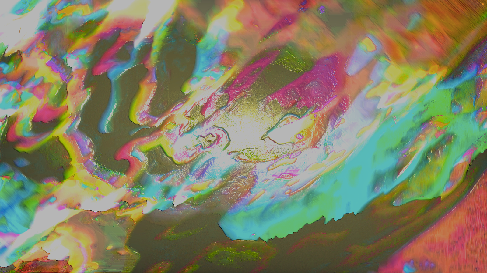
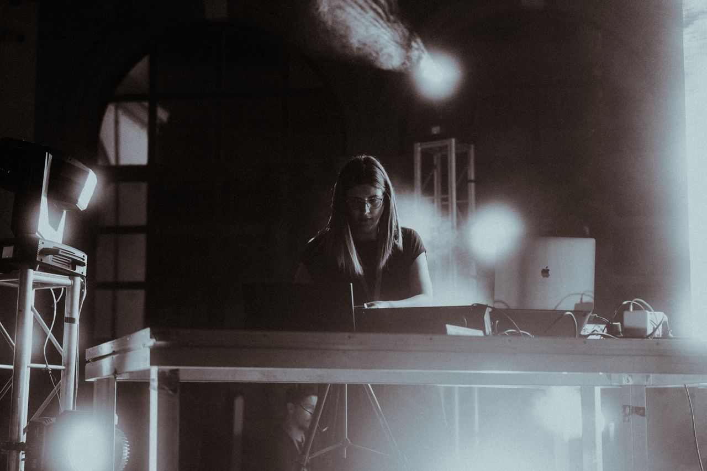
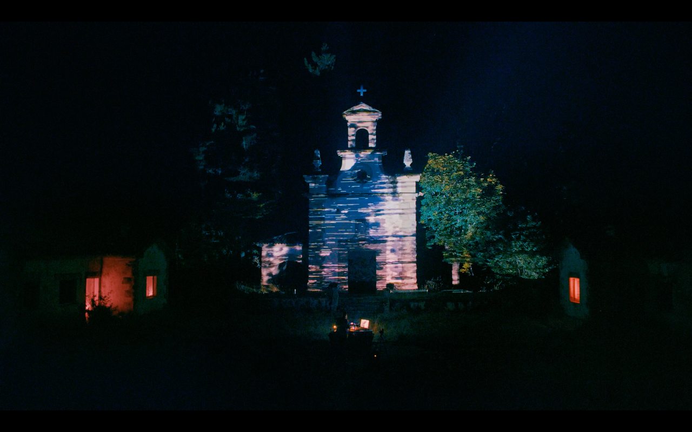
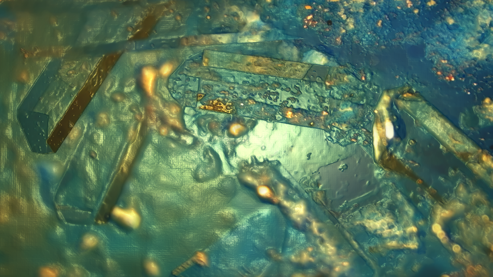
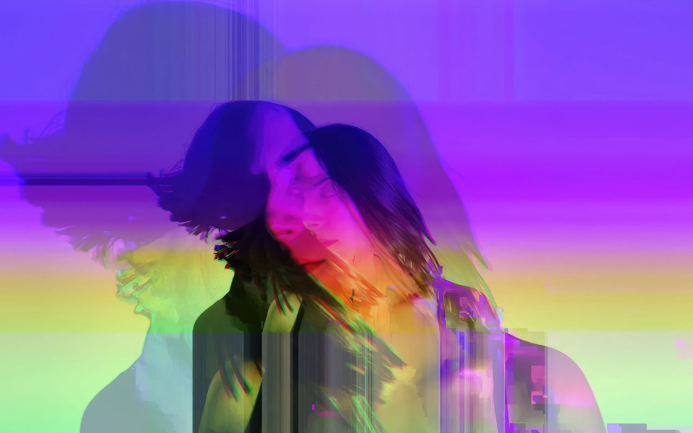
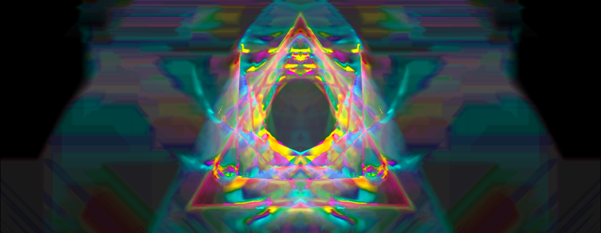

Marta Verde Baqueiro ([@martaverdebaqueiro](https://www.instagram.com/martaverdebaqueiro)) is a visual artist and creative technologist working at the intersection of realtime audiovisual performance, generative systems, and experimental video. Her work explores feedback, signal behavior, and visual texture through hybrid setups that combine software tools with modular video synthesis. She has presented projects at festivals and events such as Sónar +D, Ars Electronica, MIRA Barcelona, SEMINCI or WOS, and collaborates regularly with musicians and performing artists.

<!--truncate-->

## Background

Marta's video art journey began in 2009, after getting her Fine Arts degree, some of her musician friends asked if she would create live visuals for an interesting project called "Projecto Trepia" which would fuse the worlds of traditional Galician folk music with electronics, dance, and live performances. "At the time I barely knew what 'live visuals' meant" she'd admit, but this didn't stop her from experimenting with Numark NuVJ controllers and low-resolution archival footage of local celebrations and the everyday lives of people living in rural Galicia. "That experience made me fall in love with realtime image manipulation and pushed me to start learning programming so I could build my own visual tools."

## Process

Marta describes her process as a series of improvisational "happy accidents." "When working with modular video synthesis I spend a lot of time patching unexpected signal paths, manipulating feedback, and combining analog video with digital sources coming from software systems I build myself," she explains. Her current setup includes a Vidiot, Videomancer, Staircase, War of the Ants, and Sensory Translator that she uses in hybrid with software tools for final touches. "Because much of my work happens in live performance, many of these visual moments are ephemeral and impossible to reproduce exactly. That's something I love about modular systems: unlike software, there are no presets. Even if I document a patch, the result will never behave exactly the same way again."

## Current Work

Marta is currently working on various projects, including applications for a PhD focused on the perception of visual texture in digital media, a collaborative audio-visual performance with José Venditti, and some experimenting with optical visual generation using cameras, mirrors, and polarized filters. Marta is looking forward to Chromagnon's release, further expanding her modular setup, and experimenting with synchronization between video and lighting systems.

