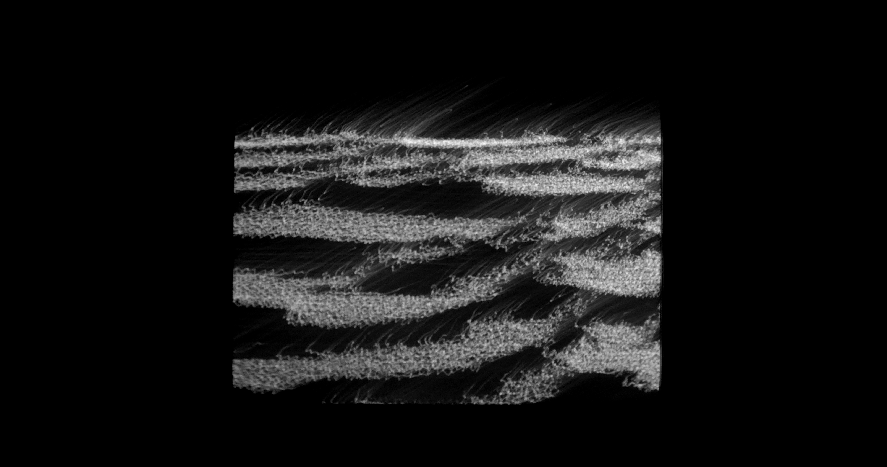
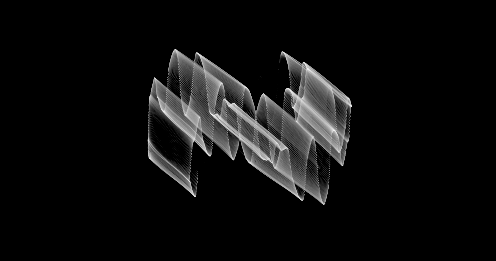
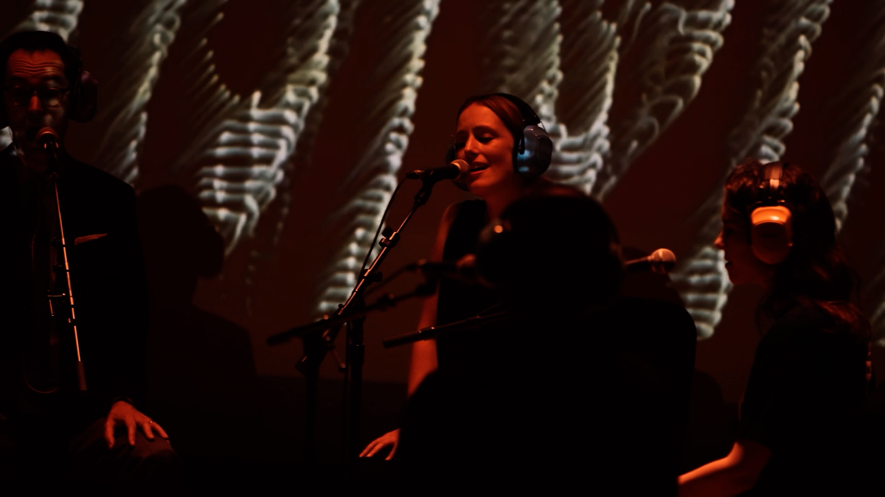
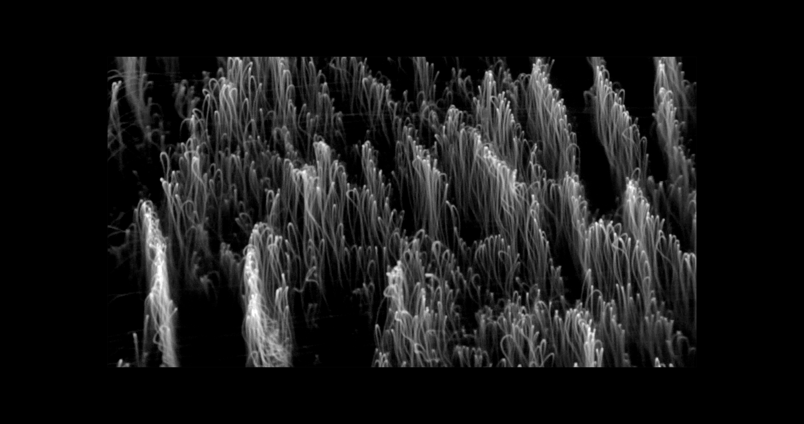
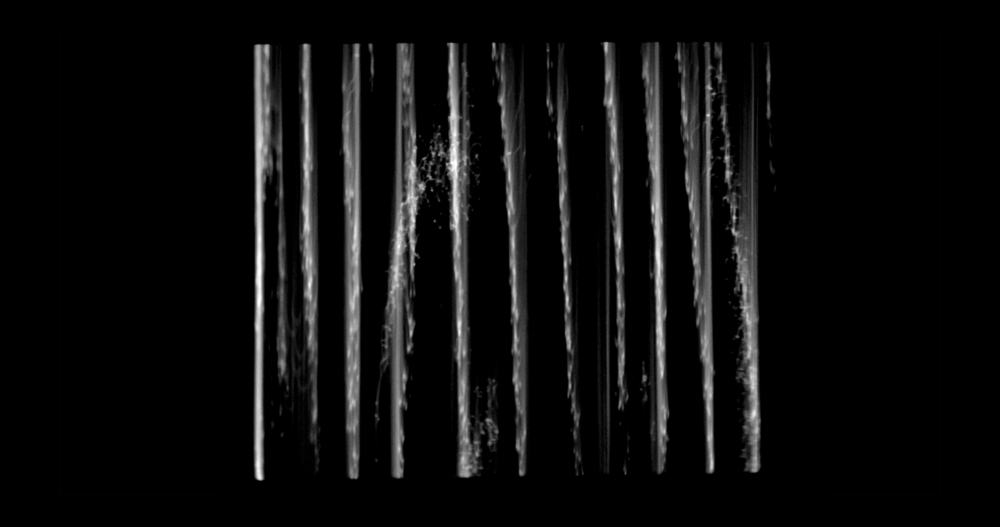

Devin Greenwood is a New York-based composer and audio-visual artist whose work explores the intersection of wave phenomena and collective behavior. He began his journey after discovering his love of scan-processing, using an oscilloscope he had purchased on Craigslist for his recording studio. "Then years later, right before the pandemic, I happened to walk into a Nam June Paik show at the Tate Modern in London and somehow I knew, in that moment, that my future was tied to video art."

<!--truncate-->

## Background

During this time he coincidentally met Benton C Bainbridge, who complimented his work and encouraged him to visit his studio in the Bronx, where he began to learn about the world of vector synthesis. Over the next few years he would invest in a larger setup, easily fusing the world of music production — one he was already very familiar with — and the world of visuals. He valued putting his best foot forward at every step of his process. "It turned out that I could reliably make very personal artworks that I really loved, and it honestly transformed me as a person."

## Process

Devin views his process as very intentional layers that cascade upon each other — layers of music, editing, performance, and visuals. "I try to make each layer of the process joyful. Each step is an event! A party. And then when all the steps are combined, something useful has been created that didn't exist, and that makes me happy."

## Current Work

Devin is currently working on musical productions with accompanying films, such as his work composing _Polycule: For Six Singers_ via a video score of color as the backdrop for their performance. He is also working on a piece inspired by his father, who passed away in 2023, set to old Super 8 footage his father had shot of him as a baby.

Devin is looking forward to further exploring the world of scanline manipulation, a world with a lot of unexplored territory for him.

"The flicker of the oscilloscopic image contains something of the fascination-with-fire that feels ancestral and ancient to me. It's like the knowledge of fire gave our ancestors the ability to feel protected and warm and nourished in a way that changed their relationship to their surroundings. It made new curiosities and desires possible. Marshall McLuhan called all technology 'extensions' of the human body, and fire was the first 'extension' that harnessed the power of the universe itself."

