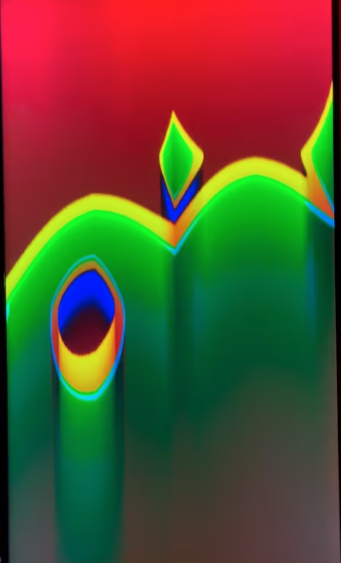
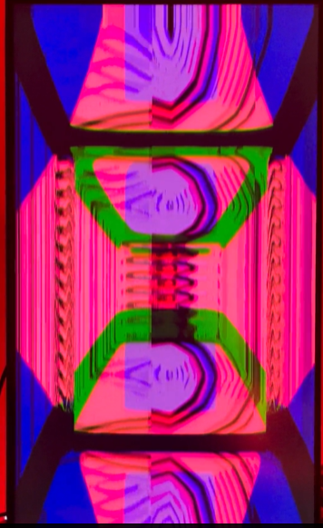

Timothy Lapointe is a visual artist working to bridge the worlds of painting and video art. After majoring in painting at the Maryland Institute College of Art, Timothy began exploring animation and CGI as a way to transform his paintings into intuitive, living worlds with movement and depth. "Both the mediums of painting and synthesis — whether video or audio — are at their essence elemental and untamed. It is up to the artist to determine if or how to bring them into focus. I was drawn to video to begin making emotional, unconscious, and intuitive choices with color and shape in animation."

<!--truncate-->

## Process

In painting, Timothy layers paint with intention, creating unfamiliar and complex images that yield intriguing results. "A painting is done when it feels resolved and I can't stop looking at it." In video, he starts with something simple like a signal chain and slowly begins adding layers to build complexity. "Many patches start with 'what if I tried this combination?' — a few steps later I am happily in uncharted territory. Rarely do I get somewhere interesting by aiming for an outcome from the beginning." This process of creating, combining, and reflecting has led him to produce unique and vulnerable pieces of work in both mediums.

## Current Work

Timothy is currently creating a series of paintings inspired by his video explorations. Similar to his usual style, he is releasing small pieces without judgment about how they compare to his overall body of work. "By this process I am fleshing out new areas of imagery ownership — a visual language. As with video, I allow the physicality of the medium to speak." He's looking forward to creating newer, bigger, and more impressive paintings for his current series, and on the digital side, he wants to explore creating new shapes where each piece builds off or is inspired by the others.

Timothy is also curious about potentially delving into the world of audio synthesis. "To make sounds that sound like the video I am creating, melding to the point where they feel inseparable. Using CV or audio to drive animations is interesting to me, but getting the pitches and textures right is essential."

