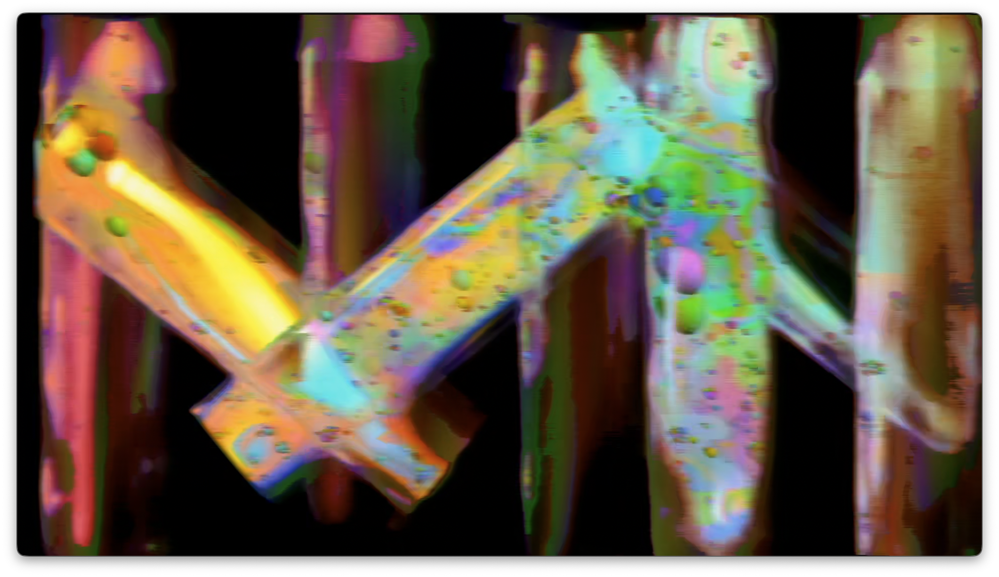
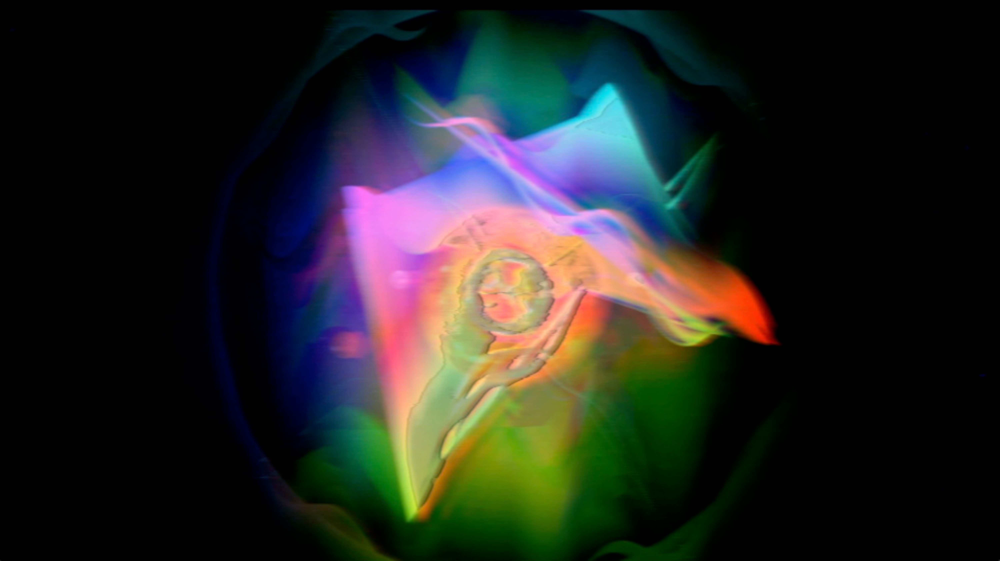

Pete Appleby is a video artist who blends video sources into new and exciting visuals. He first became involved in video creation while employed with Chevron Oil Field Research Co. in 1980, where he created simulations of oil field production using IBM mainframes, Cray supercomputers, and DEC minicomputers. "Chevron also used a lot of miscellaneous hardware such as film and video recorders, plotters, and digitizing tablets. I was fortunate to be able to learn to program interfaces to these devices. It hardly seemed like work at all for a young and curious programmer. This is where my video passion began!"

<!--truncate-->

_Between Dimensions_

## Process

Pete begins with a base picture or video, either filmed by him or taken from his library of CGI clips, then experiments by patching into his module setup. After a few days of adding and subtracting, it's time to edit hours of footage into a shorter, more digestible clip to share with others. "This is the hardest part. A wise person once said, 'The cutting room floor is a bitch!'"

_Chemistry 101_

## Current Work

Currently, Pete is exploring the use of video-rate CV for modulation, a new facet of video processing he has yet to experiment with. In this project, he is using a combination of lights, crystals, and laser pointers to create a unique blend with various CGI clips. His short-term goal is to keep learning how to use Videomancer in new and unique ways to inspire his creative process. He also looks forward to the anticipated release of Chromagnon.

_Crystal Explorartions Volume I_

_My Magic Marble II_
