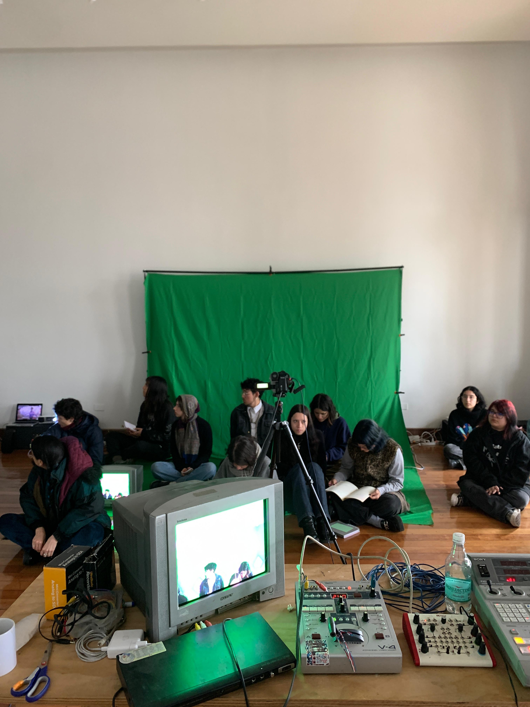
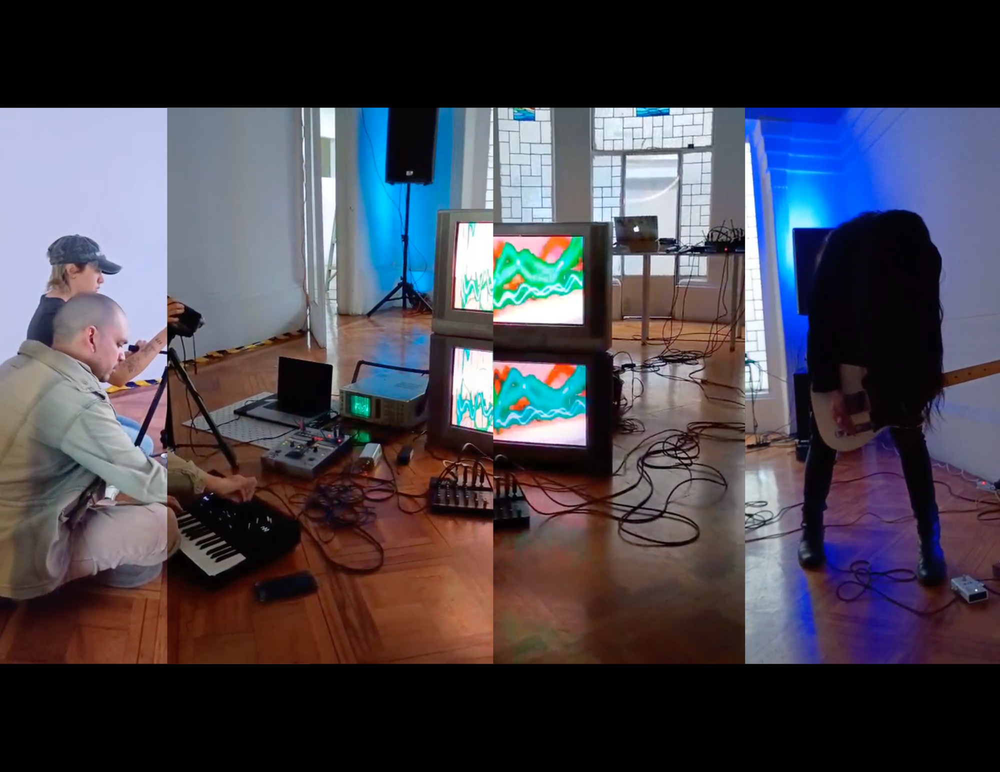
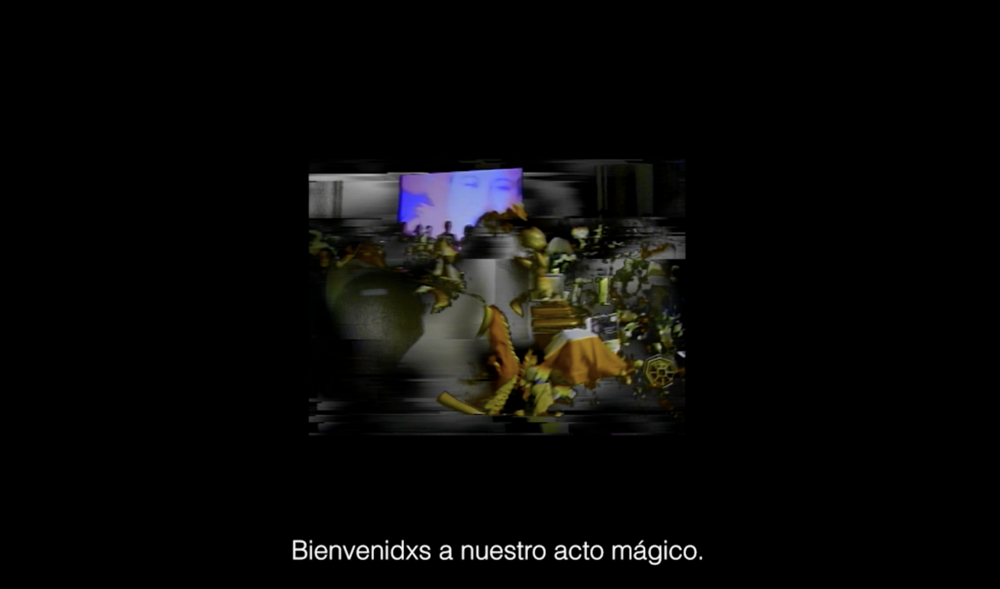

Jaime Dames is a video art professor and video artist from Chile. "I lead an educational project called Taller De Video Analógico, where I create learning experiences focused on exploring video feedback, glitch, and their possibilities as creative resources." Through his work as a teacher, he has developed a stylistic arsenal of work he has shared in installations, media, and through VJ practice.

<!--truncate-->

*Taller De Video Analógico — Chroma Key Workshop*

## Process

Dames experiments with analog and digital formats, for example, the modulation of color and form, video feedback, and the texture of glitch. His favorite devices to use in tandem with regular video mixers or analog cameras include Vidiot, Diver, LFO, and VCO, for their straightforward and accessible way to experiment with video. As a professor, he finds using tools like these — especially the Vidiot — "motivates participants to continue experimenting," and encourages his students to use physical tools for video effects.

*Laitek*

*Error Profundo — Fiesta de Videos*

## Current Work

Currently, Jaime Dames is working on magical rituals and short films using video art. Using video synthesis, feedback, and CRT TVs, he generates ritual spaces and totems to invoke spirits. "My latest ritual, 'Video Ouija for Lemebel,' was presented at Hiperrealidades, the 17th Media Arts Biennial of Santiago," an art event organized by the Chilean Corporation of Video and Electronic Arts, focusing on the intersections of technology, human, and non-human realities.

*Video Ouija for Lemebel*

As for the short films, he focuses on creating video feedback systems for media performances and short films to be performed live, using archival footage, live sound, and video mixers. "This year, I am interested in deepening my exploration of ritual experiences and altered states of consciousness through patterns generated by video synthesizers."

*FAUL — Films of the Future Festival*
