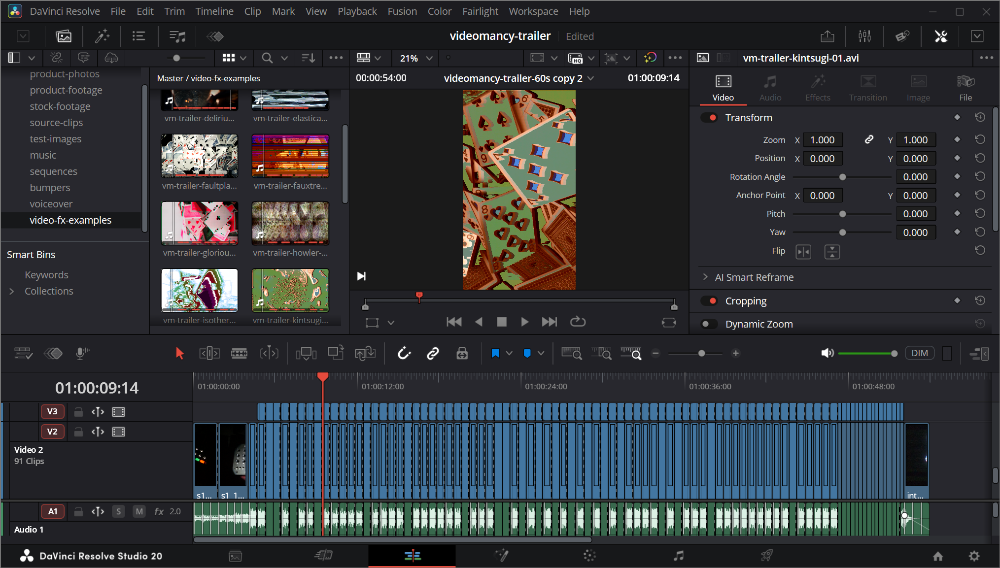

We put together a new demo reel showcasing raw output from the 24 programs available in the current release candidate firmware, [Videomancer 1.0.0-rc.13](https://github.com/lzxindustries/videomancer-firmware/releases/tag/videomancer%2F1.0.0-rc.13). Each clip is a direct capture from Videomancer with no external processing — what you see is what the instrument produces.

<!--truncate-->

<iframe width="560" height="315" src="https://www.youtube.com/embed/7cY8loTRU78" title="Videomancer Demo Reel — April 2026" frameborder="0" allow="accelerometer; autoplay; clipboard-write; encrypted-media; gyroscope; picture-in-picture; web-share" referrerpolicy="strict-origin-when-cross-origin" allowfullscreen></iframe>

To make this demo, I cut together some stock footage of playing cards to a music track using [DaVinci Resolve](https://www.blackmagicdesign.com/products/davinciresolve) from Blackmagic Design. If you're looking for a professional-grade video editor to work with your own Videomancer captures, DaVinci Resolve has a fully featured free version available.

I then processed the edit using Videomancer -- one complete pass for each of the programs. At this point I re-imported the effects takes into DaVinci resolve, aligned them to the original timeline, and chopped them up at the same cut marks as the original edit. The whole process took about 3 hours, which I was quite happy with.

I realize a lot of folks using Videomancer and our other equipment don't have a video production or film school background -- and that's great! Drop in the [Discord](https://discord.gg/lzx) if you need any help getting started with projects like this.

:::note
For the latest Videomancer news, product details, and ordering info, visit [lzxindustries.net](https://lzxindustries.net).
:::
