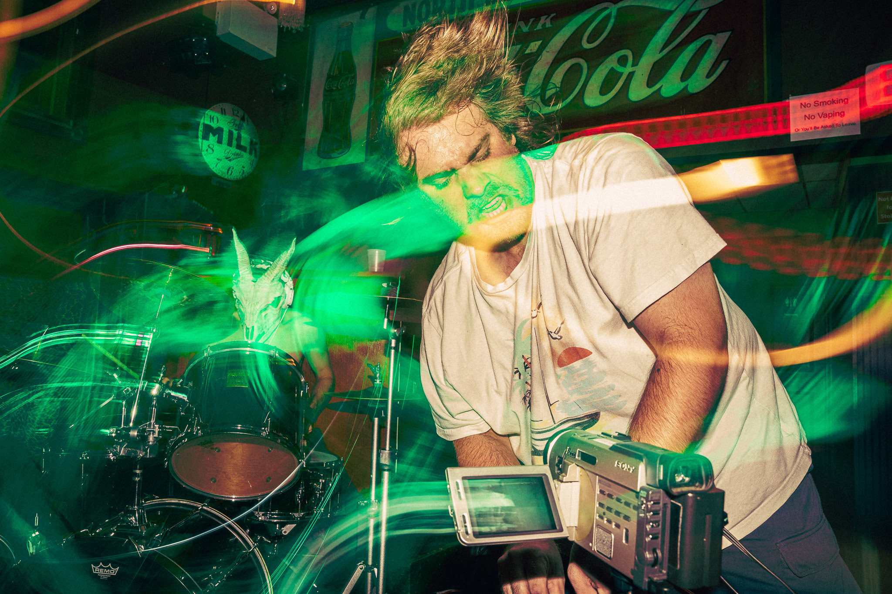
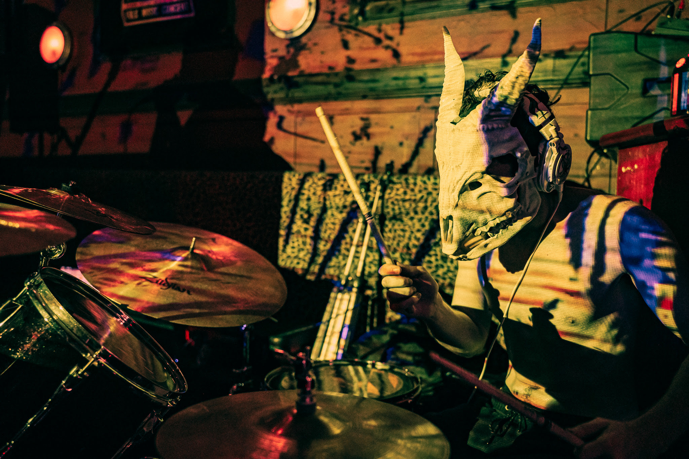
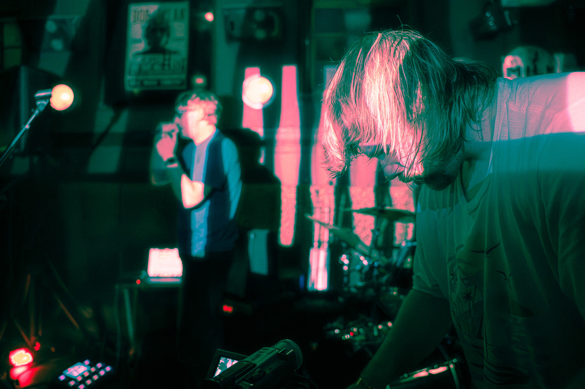
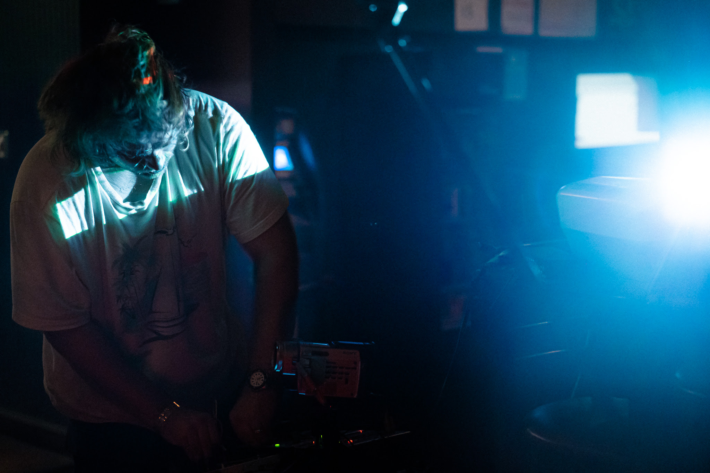
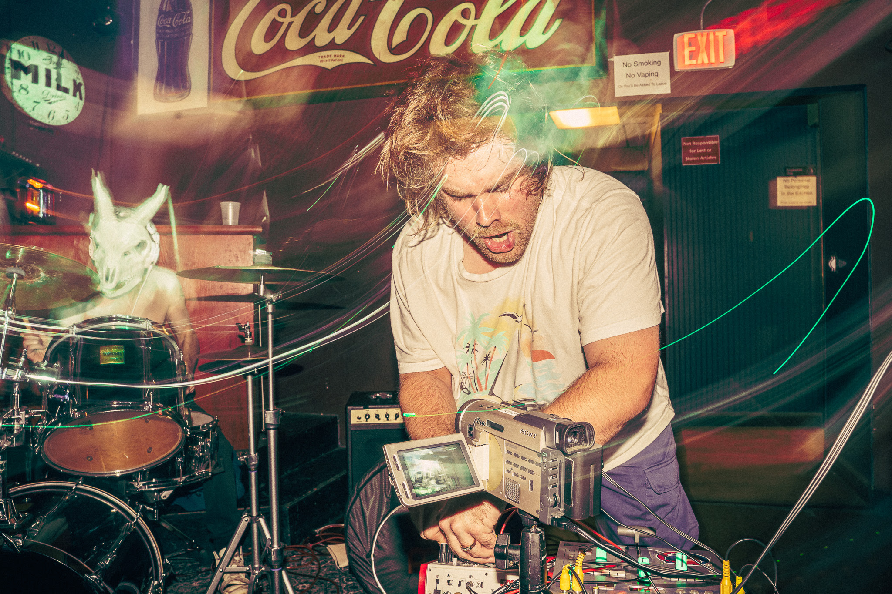
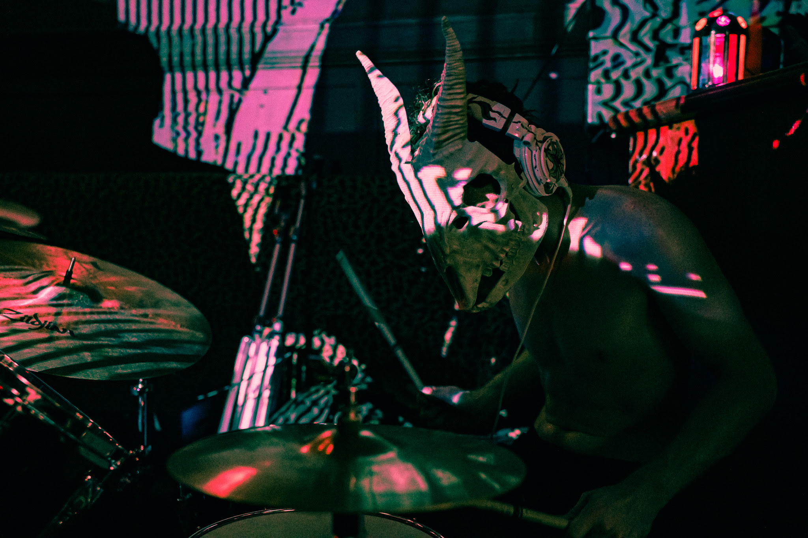

Derick Noetzel is a video artist and live visual collaborator. After a friend showed him a video of Vidiot, he preordered it without any prior video art experience, or even an awareness of what it was. He wanted tools to further experiment with the production of his music videos, and after getting used to the world of video, he started to experiment with analog video overlays.

<!--truncate-->

## Background

"I would edit a video, then run it through the Vidiot to create impressions of analog video art living on top of the first draft to add a unique element to the project."

## Process

Gradually, Derick became more in tune with the world of video, becoming acquainted with fellow artists and inspired by the potential of creation. "My friends helped me understand what was possible with this instrument. Adding outputs and hardware could have me making full analog video light shows with projectors and TVs. So that's what I started to do, collecting any and all monitors to maximize my visual output at live events where I now create immersive audio-reactive light shows to add depth to the performance." Nowadays, his setup for live shows includes a camcorder, LZX Vidiot, Roland Edirol V4 mixer, and a series of TVs and projectors. He aims to transform the space as much as possible.

## Current Work

Currently, Derick performs regularly and participates in nightlife in Connecticut, Massachusetts, and New York, creating in a variety of spaces for a variety of people. He looks forward to expanding his setup — adding more monitors, fine-tuning hardware, and securing bigger contracts. He also wants to invest further in visual media, creating DVDs and VHS tapes to distribute to his supporters.

