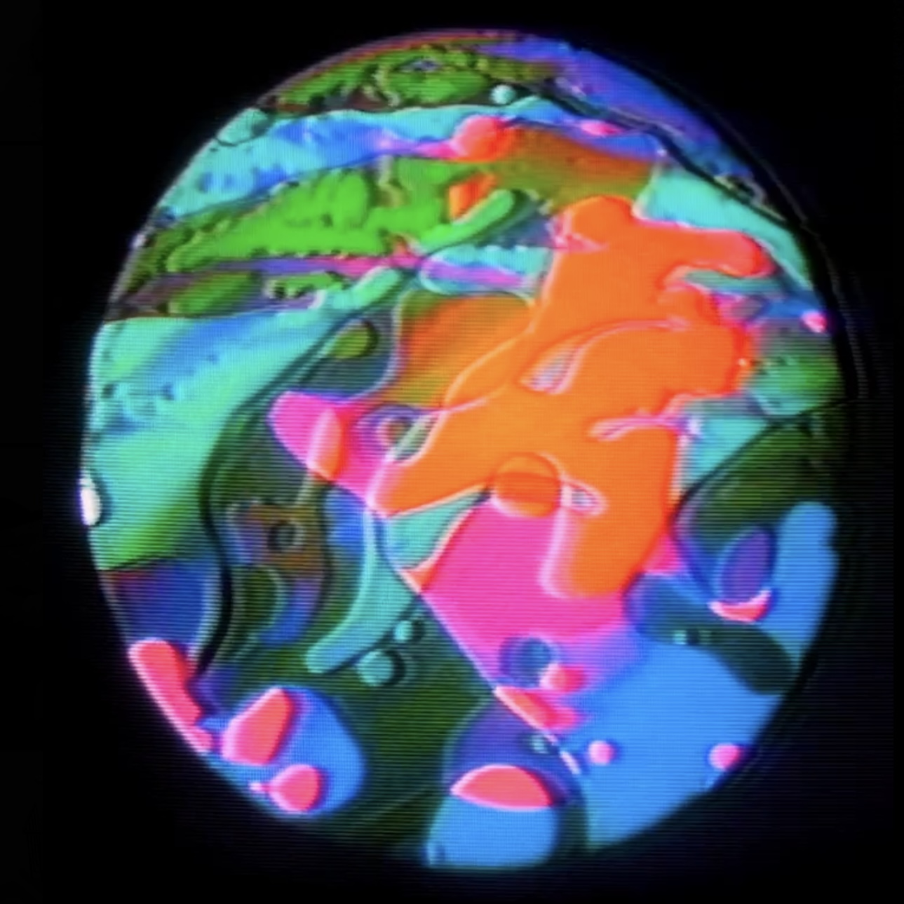
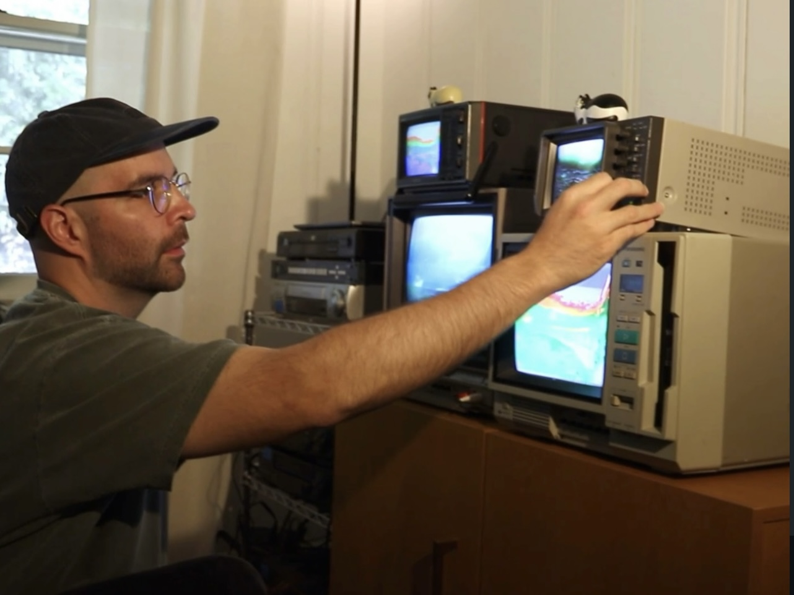
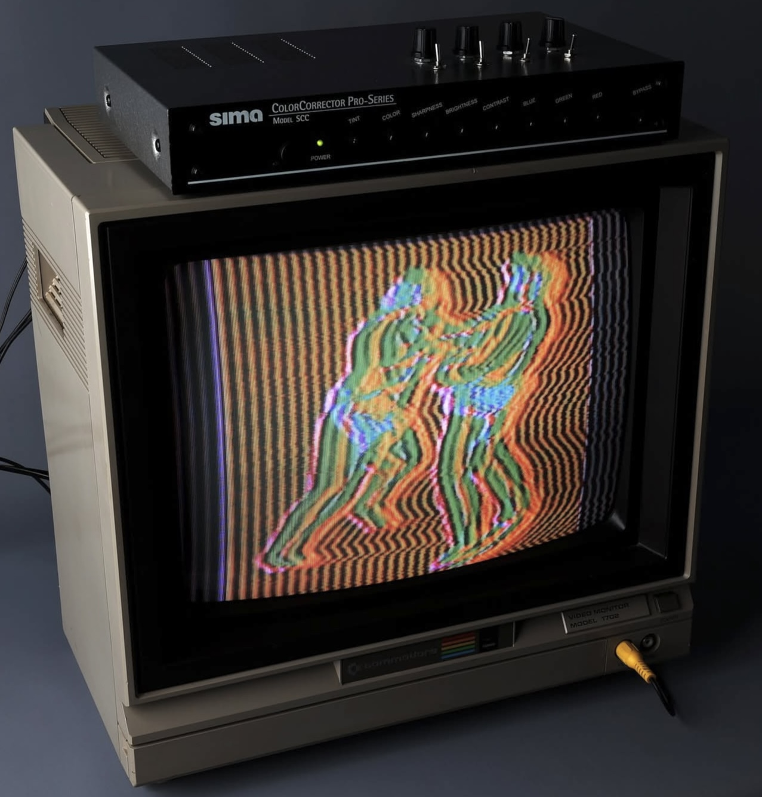
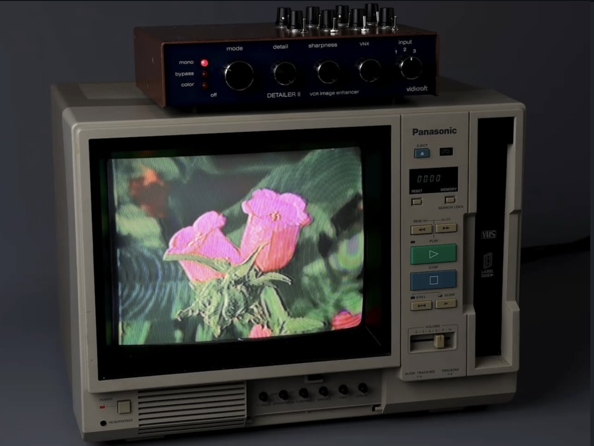
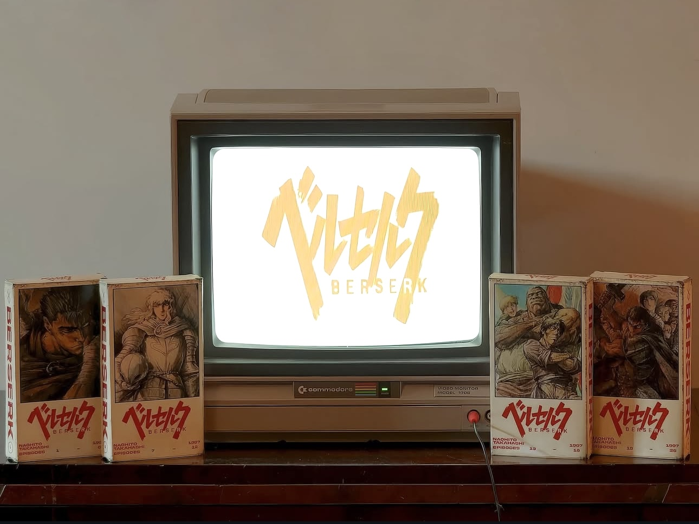

Tuna Cat is an audio-visual artist who started creating video art in 2021. It started with liquid light show experimentation on old CRTs. After experience making guitar pedals, Tuna Cat became inspired by dirty mixer schematics to create their own mixers by circuit bending old video equipment. "Currently I have five different circuit bent designs from color correctors to enhancers, each one giving me different styles and functions for video art."

<!--truncate-->

## Process

Tuna Cat finds that music pairs heavily with his creative process. "Once I know the genre of music I'm going to use, the video art becomes narrower." Every visual pairs with a different genre of music — for instance, old VHS found footage with slowcore rock, digital coding for jungle or ambient, and psychedelic for liquid light shows. Then, the footage is run into synths to find the right effects, before rescanning through a CRT. "I have been collecting them for gallery installs and studio use. With over 40 CRT TVs, it can be hard to pick which one is the one for rescanning."

## Current Work

Currently, Tuna Cat is experimenting with creating glitched VHS footage of some of their favorite anime, but plans on making their focus this year creating video sculptures due to their current interest in that genre of video art. This year, Tuna Cat is looking forward to experimenting with new ideas and materials like metal, wood, and 3D printing to pair with these projects.

