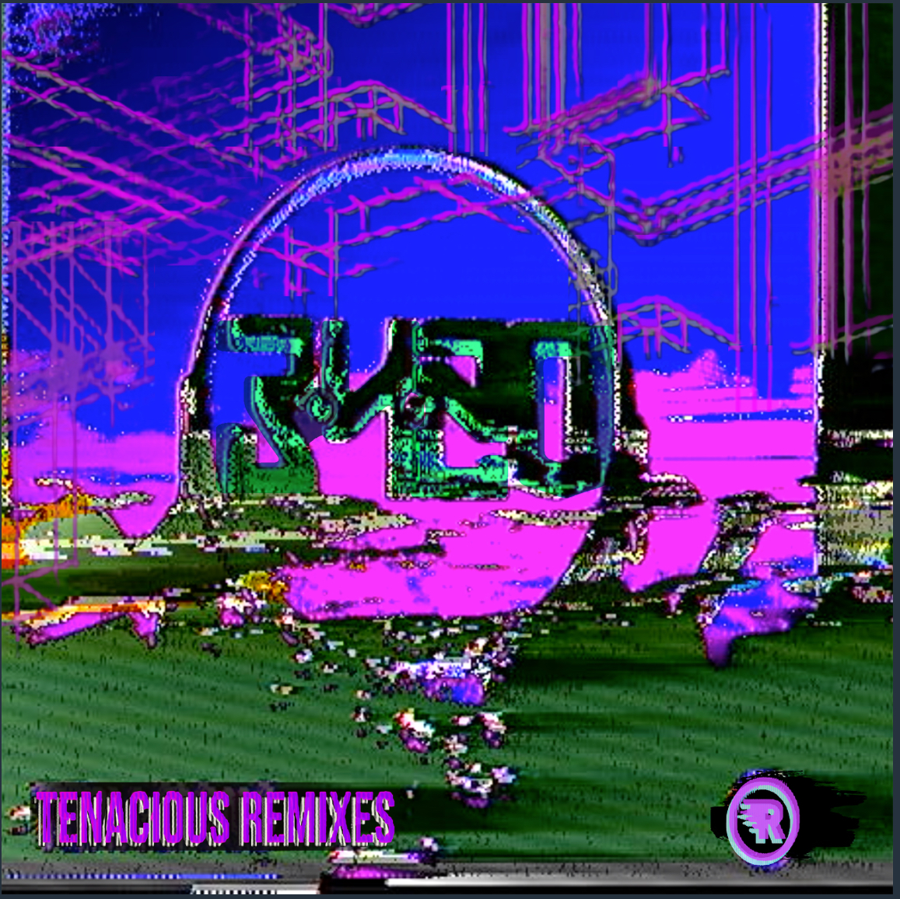
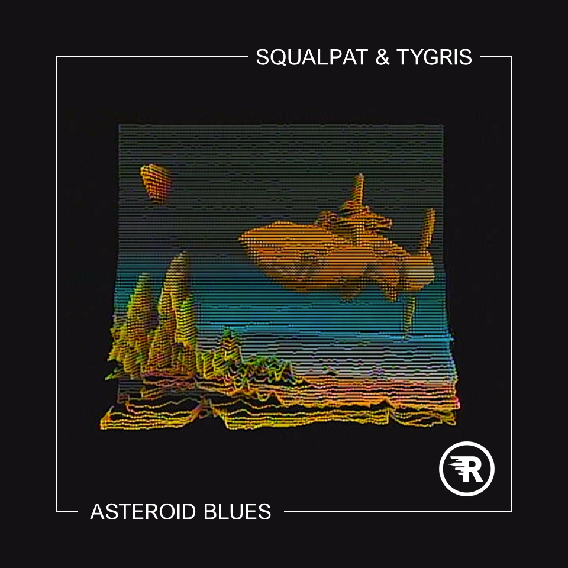
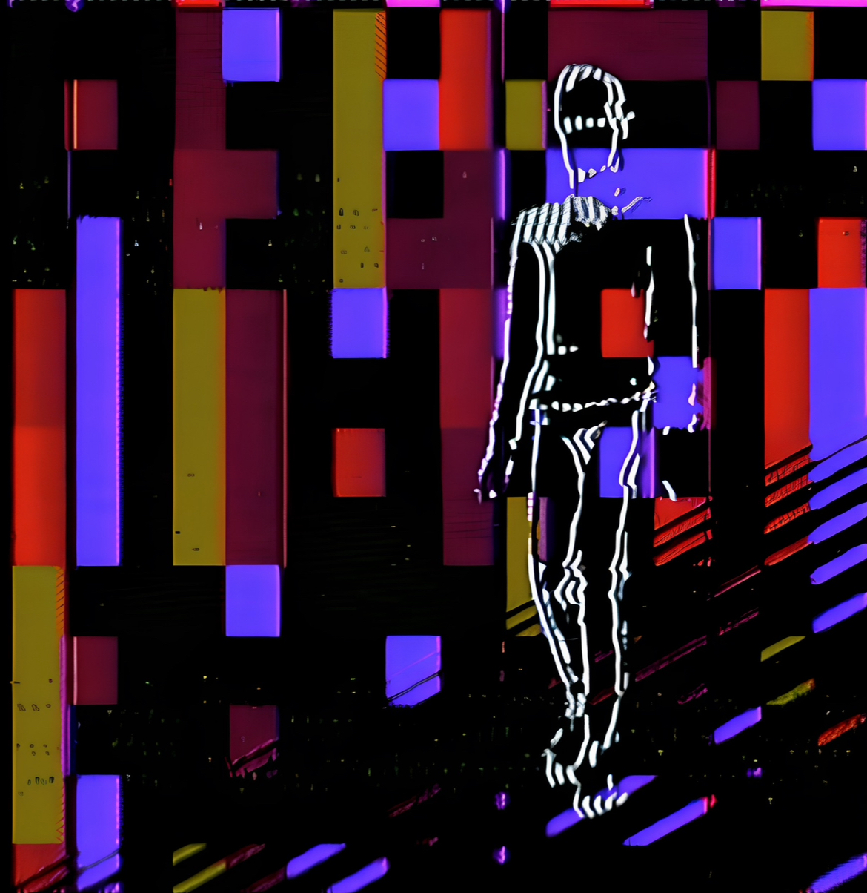
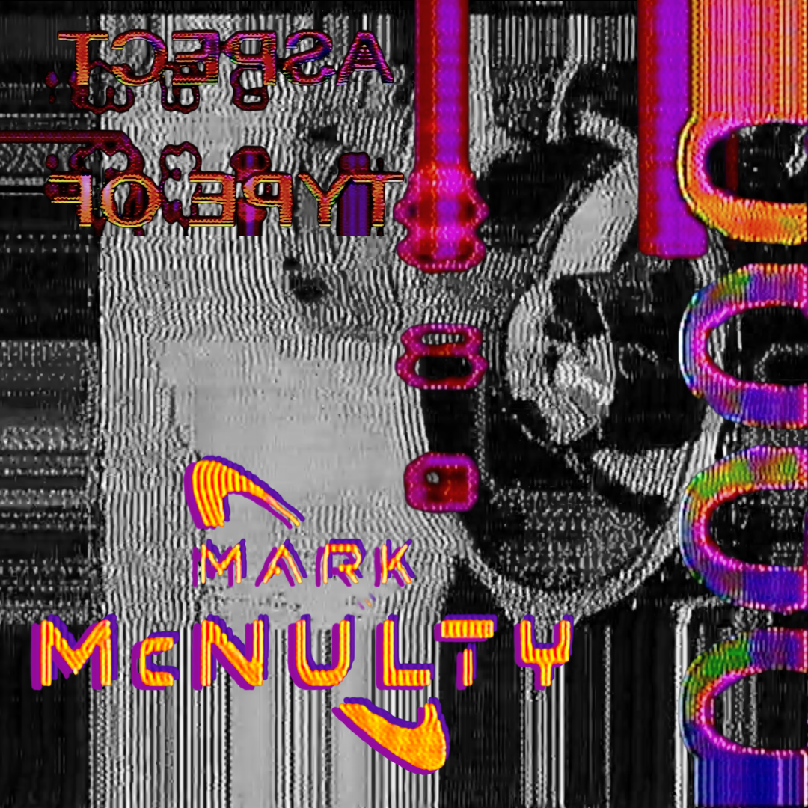
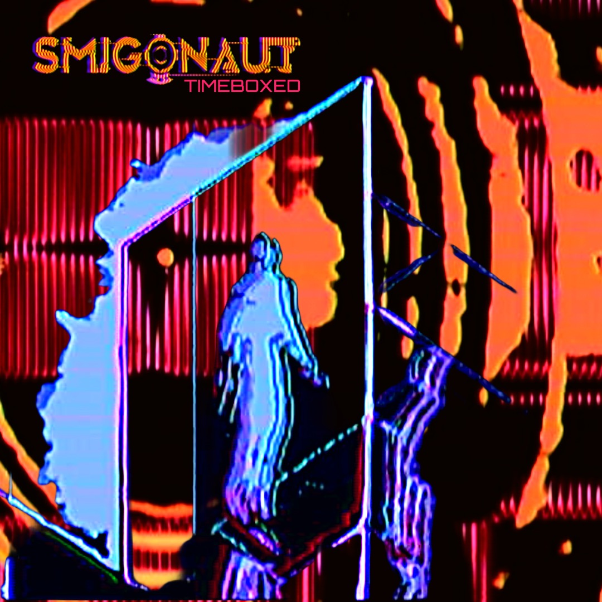

Alex Carro is a video artist whose curiosity about analog video began just before 2020. Although he wanted to pick up the hobby, he found himself lacking the money and time to invest. When COVID struck, he found himself with more time on his hands than ever before. "With the world paused, it felt like the perfect moment to finally take the leap."

<!--truncate-->

## Background

Quickly, he ordered his first modules and began his experimentation. What started as a hobby became a quick obsession. He taught himself the language of voltage and frequency modulation, and soon enough the signal began to feel more second nature than learning a musical instrument. "The tactile nature of analog video — turning knobs, patching cables, watching the signal collapse and reassemble — hooked me immediately. From that point on, it stopped being something I was dabbling in and became a core part of how I think and create."

## Process

Alex Carro's process starts with a video source material, most commonly from a historical event, documentary, or vintage film. He's drawn to that era because it sits at the crossroads of early digital optimism decorated with analog imperfection. "The first is raw video routed through the TBC2 into Ribbons, with either the DAC or inverted DAC feeding into the submixer. The second path takes the H+V or H‑V outputs from Diver, which I modulate directly with audio from the live performance. The third path is driven by DSG outputs pushed through Aural Scan, and the fourth is a DWO that runs free or gets reset by Ribbons. Everything passes through SMX into the foreground of an FKG, then into a crossfade before landing in Memory Palace. From there, I split the signal — sending one clean feed directly to my V4EX, and another through my BPMC Video Nasty to reintroduce glitch, distortion, and texture before it loops back into the V4EX." Alex finds that the balance between control and degradation is essential to the work he produces.

## Current Work

Although he spends most of his current time working on VJ performances, he has several album covers and music-related projects in the works, which allow him to step back and be more deliberate with his work and its final composition. This year, Alex hopes to dive further into still image generation rather than his usual video artwork. "It's been a surprisingly refreshing shift in perspective, trying to distill everything I love about analog video into a single, frozen moment rather than a constantly evolving signal."

