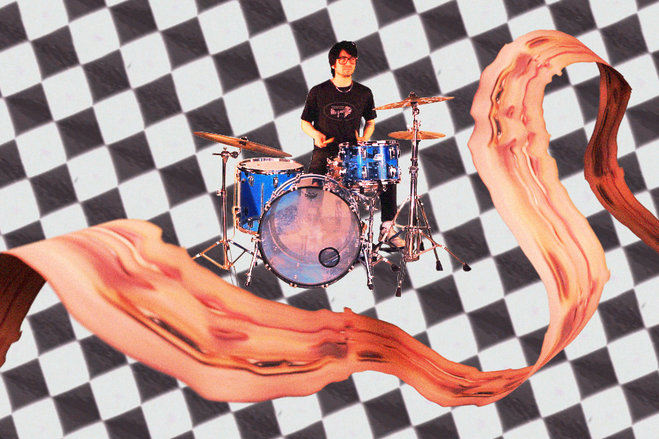
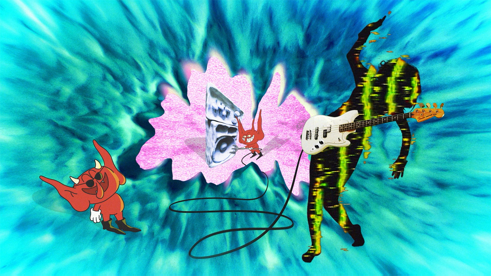
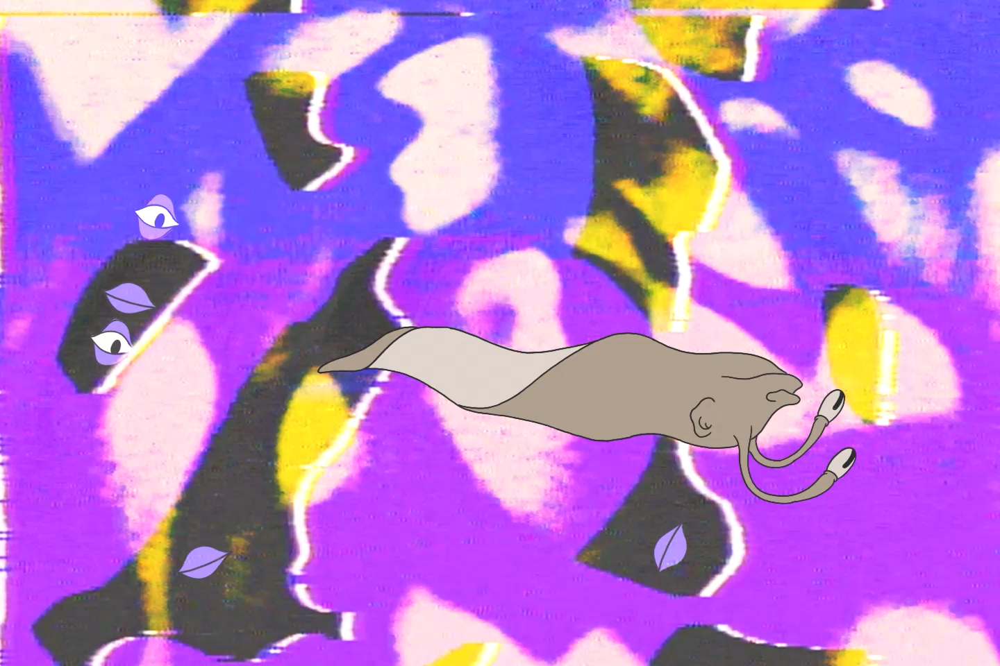
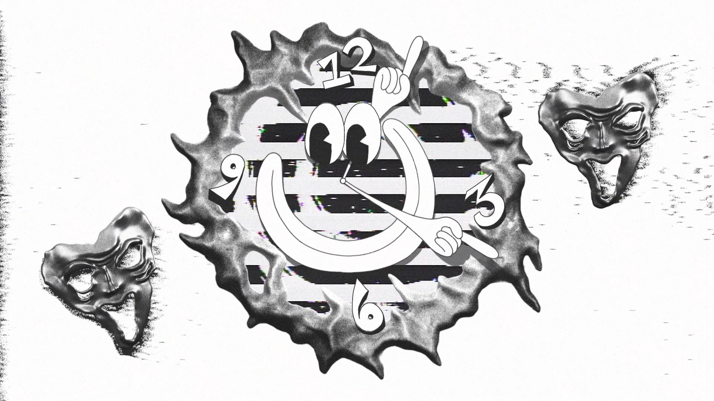
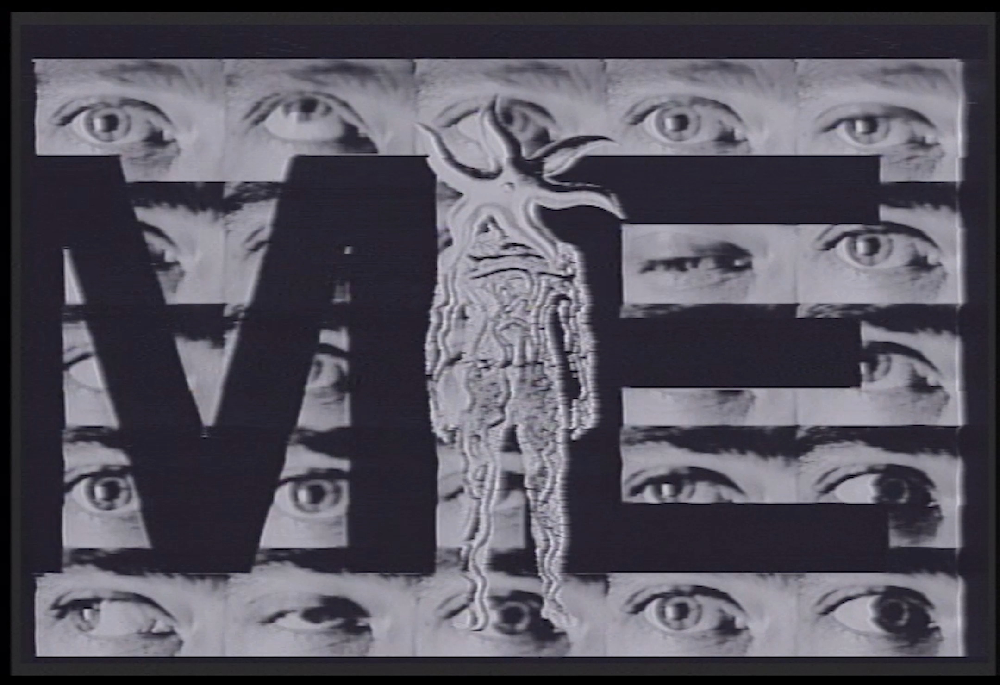
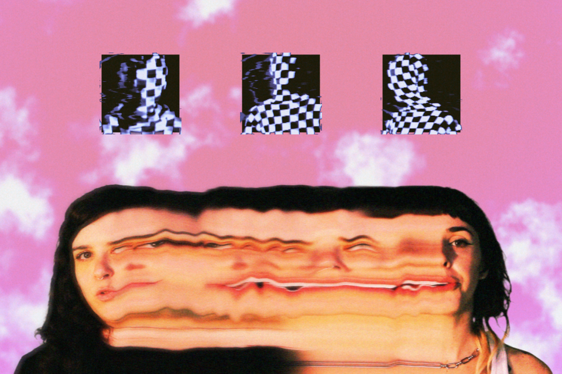

Logan Devlin is a motion designer and video artist from Portland, Oregon. After high school, Logan and his friends would collect video enhancers, detailers, and various tech from second-hand shops to experiment with. "We'd open them up and poke around all sketchy — we had no idea what we were doing." Soon he would learn enough about video effects to incorporate them into his own projects, like at-home films and skateboarding videos. "Feedback trails, noise, and all the analog characteristics of this process still feel like magic to me 12+ years later."

<!--truncate-->

## Background

Nowadays, he finds that most of his work is for music videos. His work starts with a "story" based on his chosen medium. Using animation, VFX techniques, and software like Blender, he can distort and animate his subjects. Using hardware video gear, he accentuates scenes to make them more textured, and adds some grit and interest to the digital scene created on the computer.

## Process

"I love running animations or footage through the hardware gear and then bringing them back into the scene and mashing it all together, trying to blur the line where the digital ends and the mayhem begins."

## Current Work

Currently, Logan is working on two music video projects that experiment with slitscan and time displacement in TouchDesigner. However, he always likes to find new ways to incorporate hardware gear and techniques into his video projects. Once he has wrapped up these projects, Logan looks forward to having more free time to experiment and explore new ideas.

