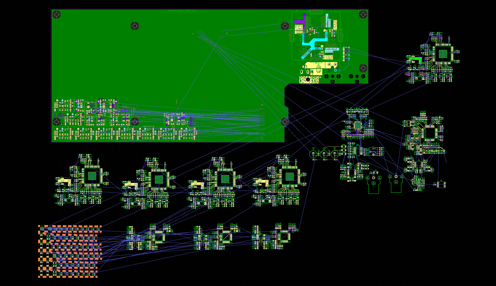

The Chromagnon production schedule is shifting by one month. Ship Unit #1 moves from August to September 2026. April was spent on Videomancer instead of placing the RevI hardware orders flagged in the [April update](/blog/chromagnon-april-update). That cost a month, but it solved a cashflow problem that would have cost more.

<!--truncate-->

## What Caused the Shift

In the [March production plan](/blog/chromagnon-building-it-right) I flagged Videomancer revenue as the ongoing factor that funds Chromagnon production purchases. That factor caught up with us: Videomancer sales in February and March fell well below what the production pipeline needs.

The cause was on me. We went quiet on social media after the March firmware update, and an instrument with no visible heartbeat doesn't sell itself. By the end of March the cashflow math didn't work, so April pivoted back to Videomancer:

- Firmware polish and additional program features driven by recent customer feedback.
- A website redesign focused on the Videomancer sales funnel.
- New trailers and ad campaigns.

That worked. Videomancer is shipping steadily to new customers, feedback has been excellent, and the cashflow problem is resolved.

## Where Chromagnon Stands

The RevI hardware order I expected to place in early April did not go out — that work was paused for the pivot. Routing continued in the background and is now in its final stages:

_RevI core board layout — routing nearly complete on all subassemblies._

From here:

- **This week:** Finish routing, run DRC, generate fab outputs.
- **Next week:** Place PCB and stencil orders.
- **Late May / early June:** Prototype boards in hand, assembled in-house.
- **June–July:** Hardware validation and firmware integration on RevI.

Firmware integration on dev hardware continued throughout April, and the Videomancer firmware work fed directly into the shared codebase. LZX Connect now has the desktop-side plumbing Chromagnon needs.

## Revised Schedule

| Milestone                             | Previous Target           | New Target               | Status                              |
| ------------------------------------- | ------------------------- | ------------------------ | ----------------------------------- |
| RevI prototype fabricated & delivered | Late April–Early May 2026 | Late May–Early June 2026 | PCB orders placing next week        |
| Hardware validation & firmware on RevI | May–June 2026            | June–July 2026           | —                                   |
| First demo content                    | May 2026                  | July 2026                | —                                   |
| **Production-ready milestone**        | **June 2026**             | **July 2026**            | —                                   |
| Production order placed & manufacturing | June–July 2026          | July–August 2026         | —                                   |
| First batch assembly & QC             | August 2026               | September 2026           | —                                   |
| **Ship Unit #1**                      | **August 2026**           | **September 2026**       | —                                   |
| Pre-order fulfillment at scale        | September 2026            | October 2026             | —                                   |

The monthly Chromagnon update cadence shifts to match.

## What Has NOT Changed

- Pre-order prices honored.
- Queue order unchanged. First in, first out.
- Feature set unchanged.
- Monthly updates continue, first week of every month.

## Next Update

First week of June, with prototype boards on the bench.

Lars

---

_Questions about your order? Email **sales@lzxindustries.net**. For general discussion, join us on [Discord](https://discord.gg/7xzD4XzhGn)._
