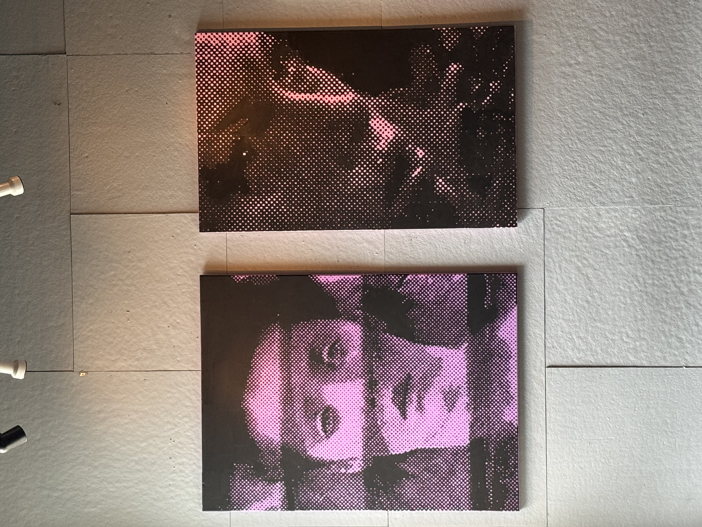
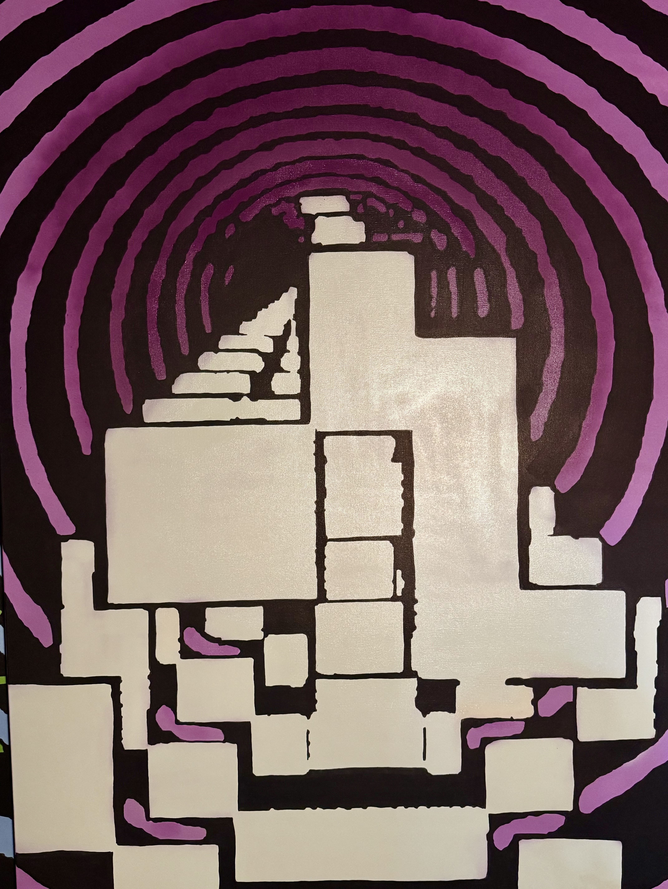
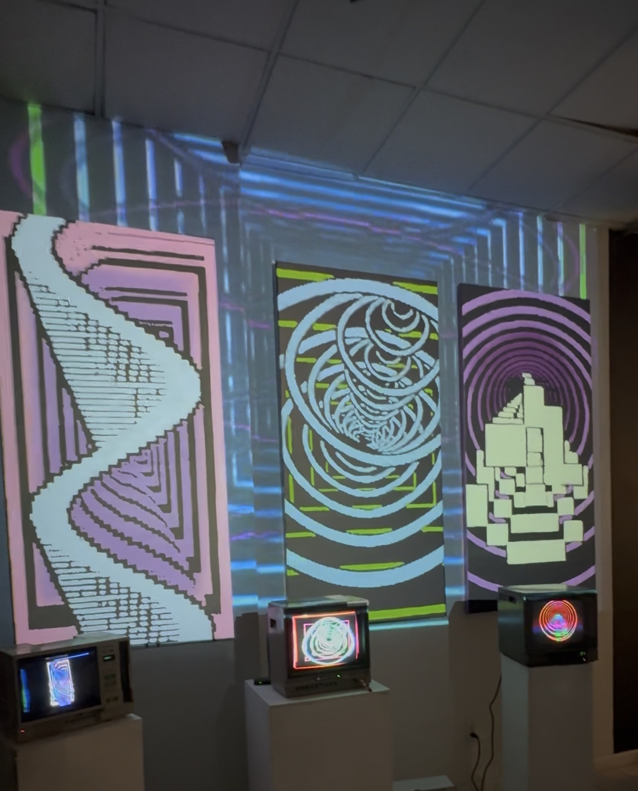
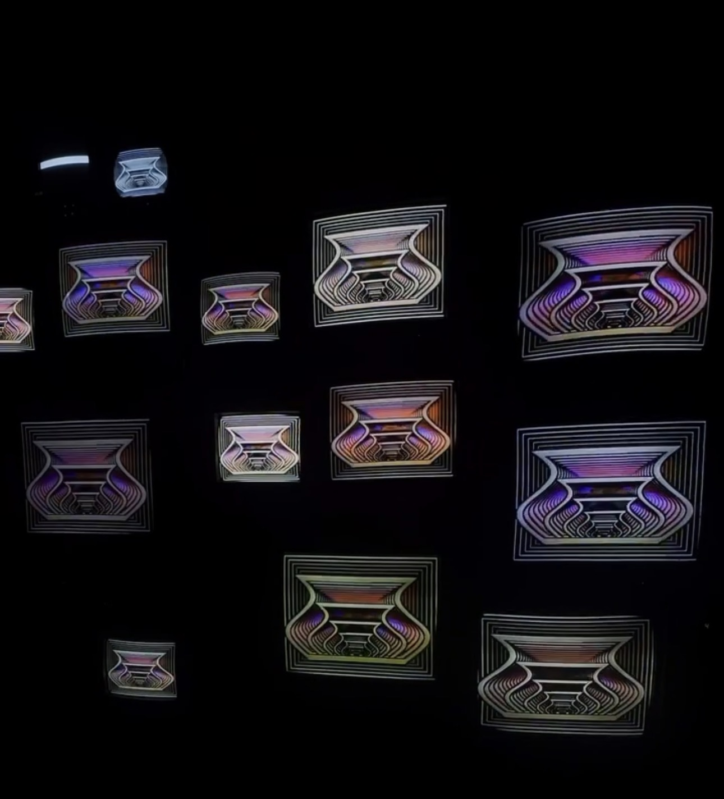
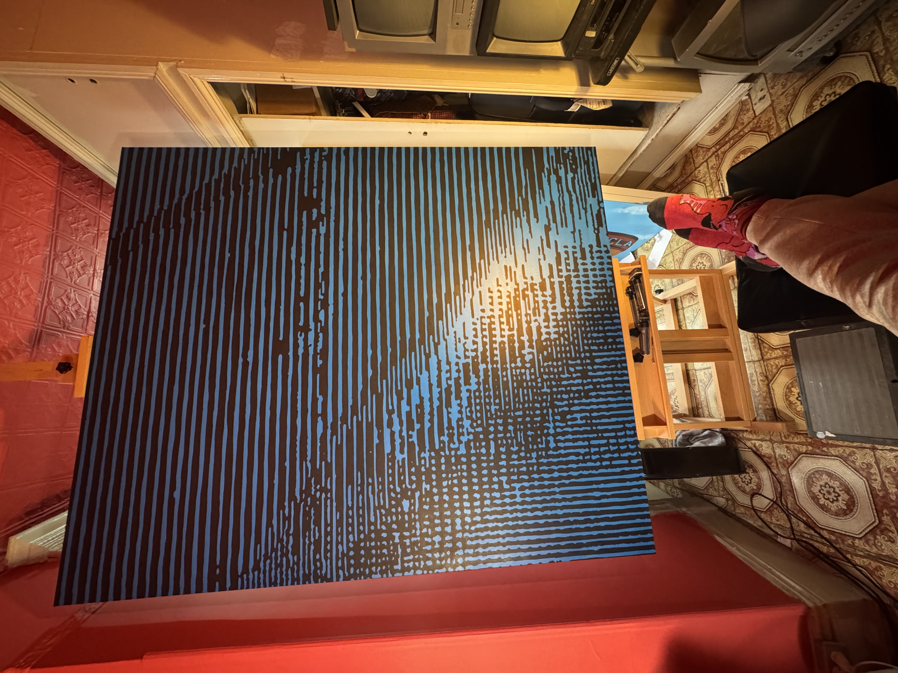
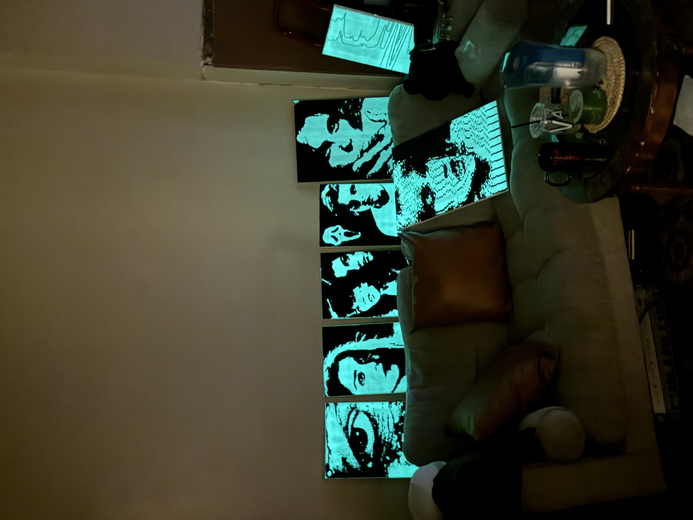

IMMA Musica is a fulltime video artist from Ridgefield, Queens. “I chose this name because it means ‘mother’ in Hebrew, and it’s also a joke about the band ABBA, since ‘Abba’ means ‘father’”. After immigrating to New York in his early twenties, he cut his hand while working as a cook, causing him to drop his hobby of playing bass and pursue electronic music. IMMA was heavily inspired by Daft Punk, and after their break up, he researched what synths they used to produce their music. This completely changed his perspective on the genre. After saving everything he had to buy a Roland Juno-106, his love for synths only grew, along with his growing collection.

<!--truncate-->

After time in the synth space, it led him to discover video synthesis. He hopped on a train to Newark, New Jersey to buy a Videonics VE-1 video equalizer, and through his search, he found the local video synth community. “That community opened my mind to glitch art and experimentation within the medium. (Shout out to Mike Video Punk, viz.wel, and spaceoctupus)”. Soon after, he found himself devoted to glitch art and VHS Tapes, with his current studio in Queens containing 2,000 VHS tapes, 40 CRT TVs, and a huge collection of video mixers and glitch boxes.

Currently, he is working on creating a live set with music and visuals, using synths to create live electronic music, a small 3-inch CRT TV with a 4K camera pointed at it for rescanning, and a glitch box to run Resolume through. He has also been experimenting with larger-scale painting using feedback as his reference for an upcoming art exhibition featuring his pieces.

IMMA Musica looks forward to doing more shows, creating more interactive installations, and hopefully releasing a tape with footage he’s recorded over the years. IMMA hopes to work on more collaborations with fellow artists around the world.

