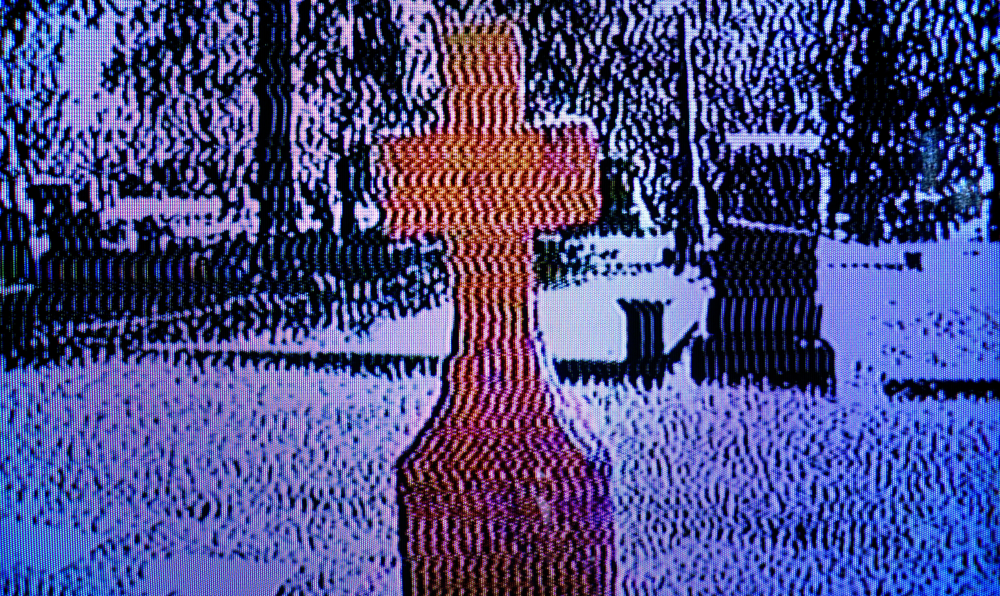
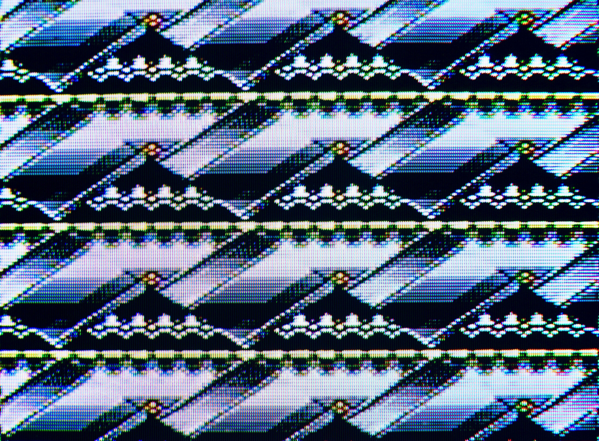
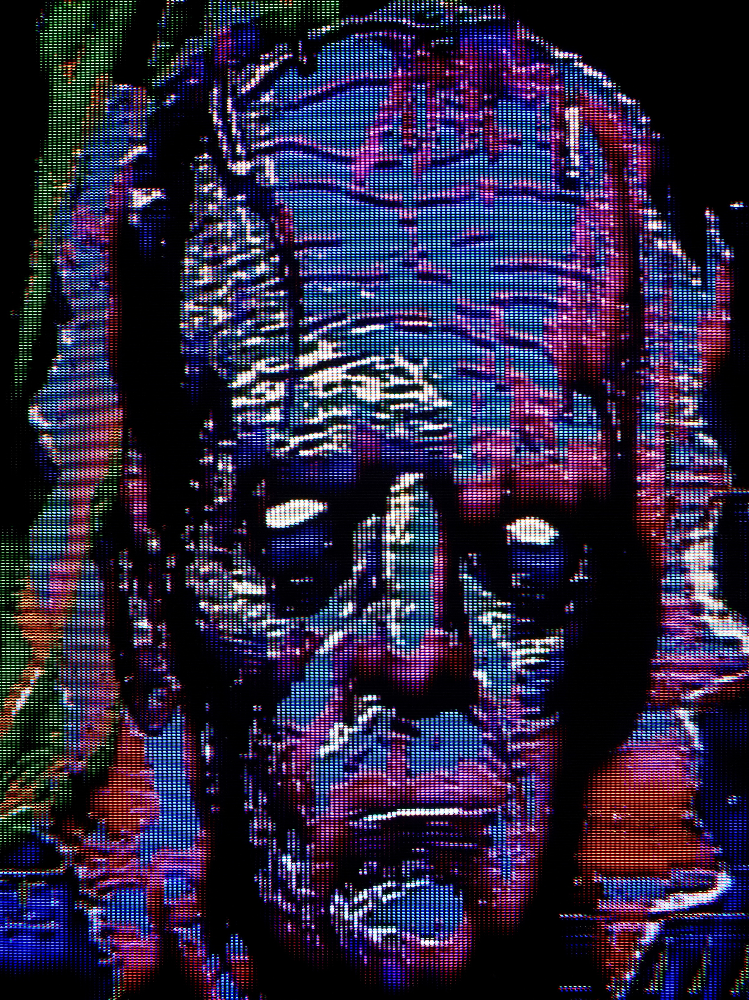
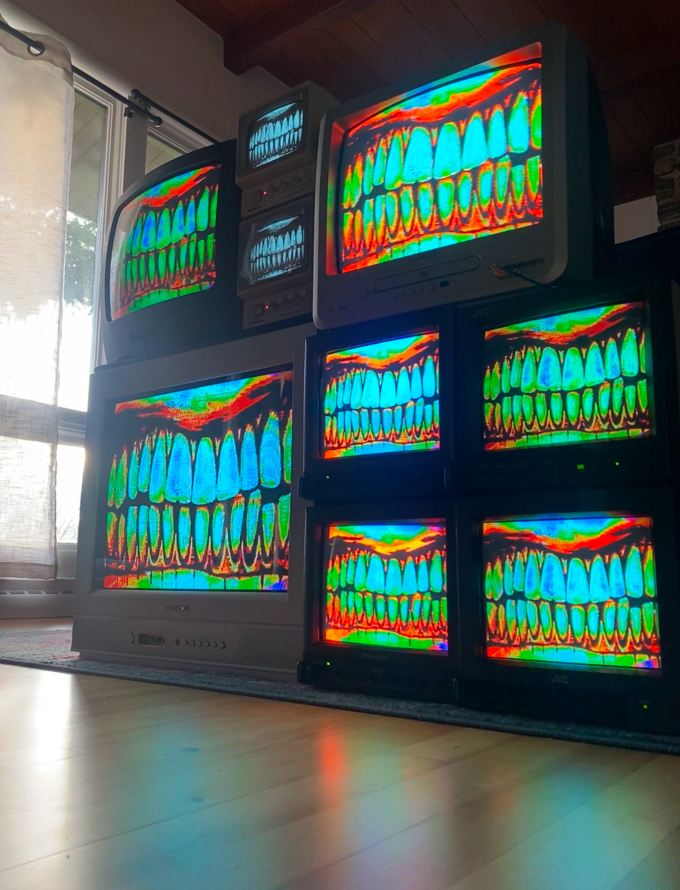
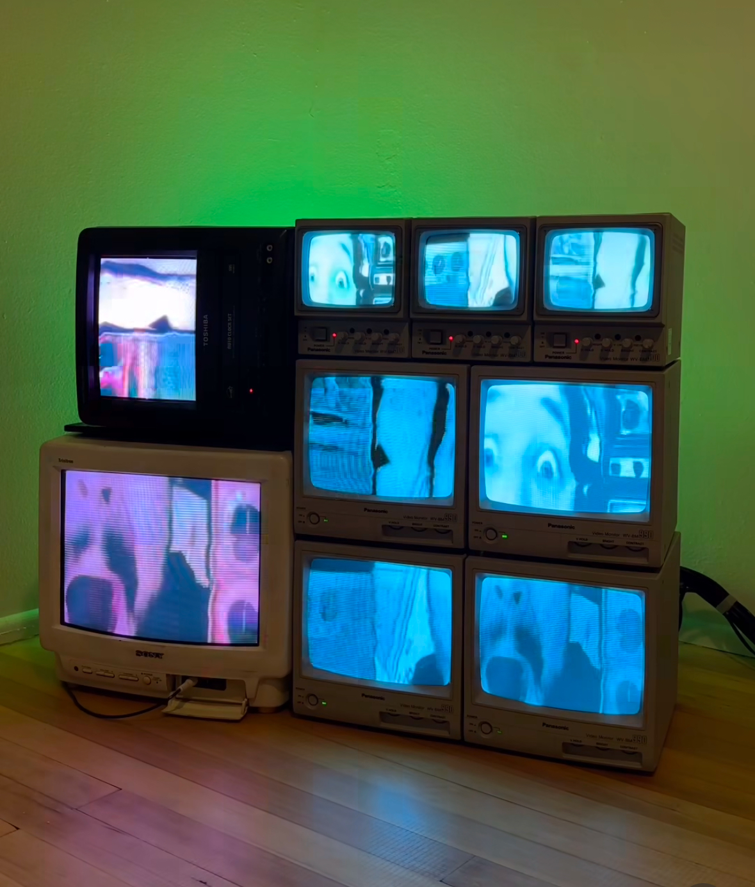
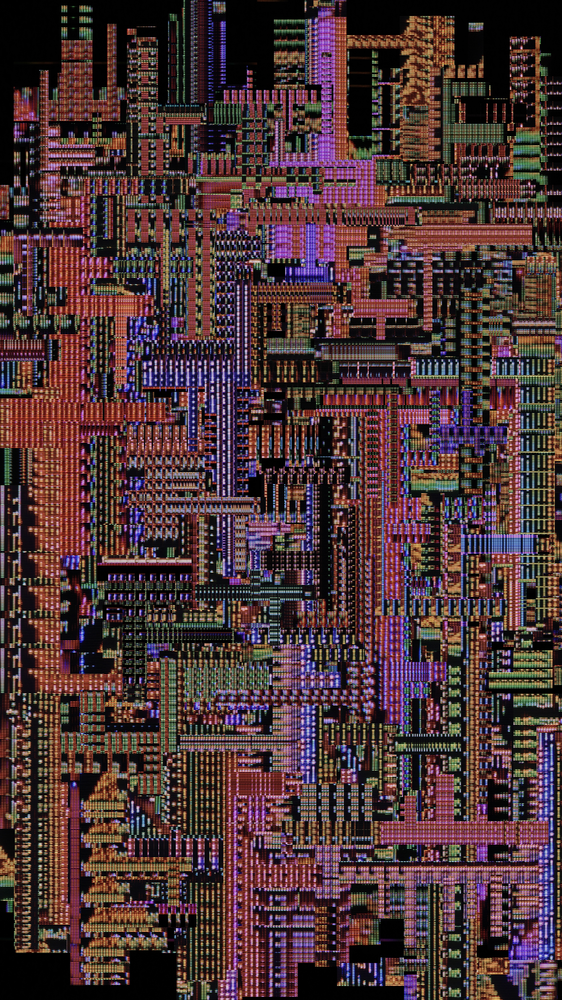

Dan Haywood (Animoscillator) is a video artist who experiments with dead media. Dan’s journey started as a kid, with a camcorder and a determination to film anything. After graduating college, he worked as a theater tech, often tinkering with old obsolete analog equipment. While touring with his Pink Floyd tribute band, he got his hands on his very own Edirol V4, which opened various doors for his creativity. “Once I figured out feedback and how to manipulate it, I became obsessed. It was like I was struck by some arcane knowledge. I saw a future there. For the first time in my life, I found a way to fully express myself”. With his background in music technology, it was easy to maneuver his way through troubleshooting. Soon enough he found an analog video art community via online forums, and it made him feel right at home.

<!--truncate-->

## Background

Nowadays, Dan’s process begins with contentious experimentation, allowing himself to have fun and get into the mood to create. Although he finds his old habit of being so technical can affect his ability to truly let loose, he views the video art community as truly inspiring through their constance of “pushing the envelope” and keeping you on your toes. “Every single aspect of my process requires experimentation, from the source material to mitigating moire when I rescan. When I fall into my go to methods I can feel burnt out and uninspired. I need to keep trying new things to keep the flame lit”. Sometimes, when it gets hard to get those juices flowing after a session, he unpatches everything, zero-ing it all out, forcing himself to start from scratch. Starting from scratch is a good way to allow happy accidents to happen and new ideas be discovered.

## Process

Currently, Dan’s working on a music video for a band he can’t yet reveal “I can’t say much more about it yet, but keep your eyes peeled!” as well as a new video pack featuring some fresh glitches. “I’m also constantly building my library of visuals for VJ sets and expanding the body of work for my CRT installations. An artist's work is never done!”

## Looking Ahead

Dan Haywood looks forward to having a small artist residency this summer, and several similar projects he’s opening will pan out. He finds that actively applying for opportunities is better than being complacent and waiting for something to fall in your lap, although it comes with a large potential of brutal rejections. However, when the acceptance letter hits, it will make it all the more worth it for putting the effort in! “That being said, I’m always looking forward to further honing my craft and expanding my artistic horizons so I will be as ready as I can be for the next project”.

