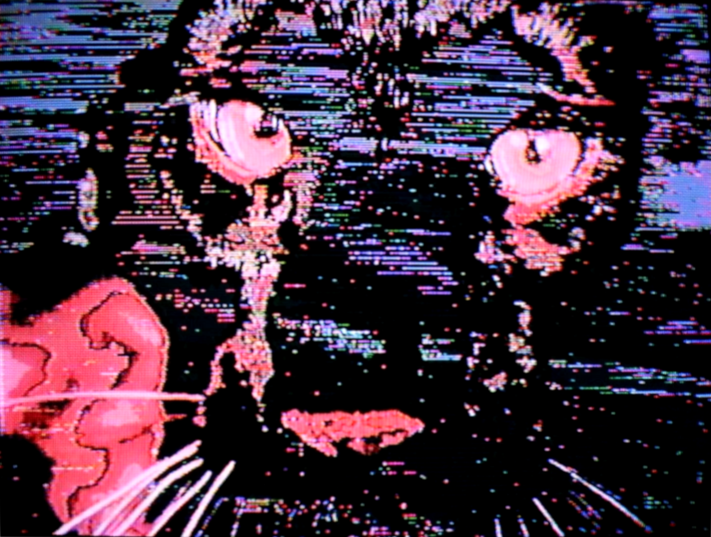
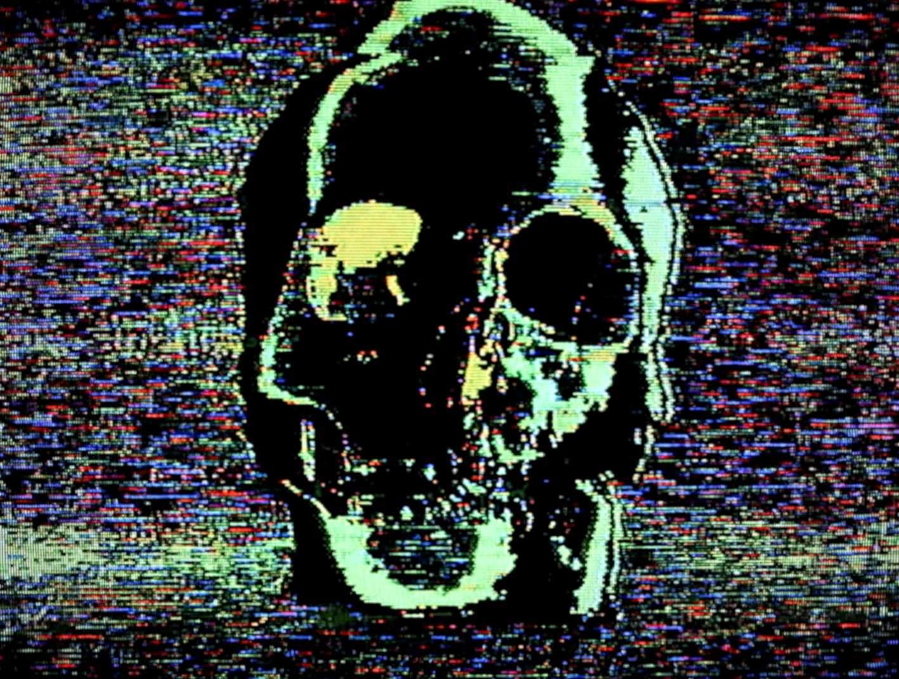
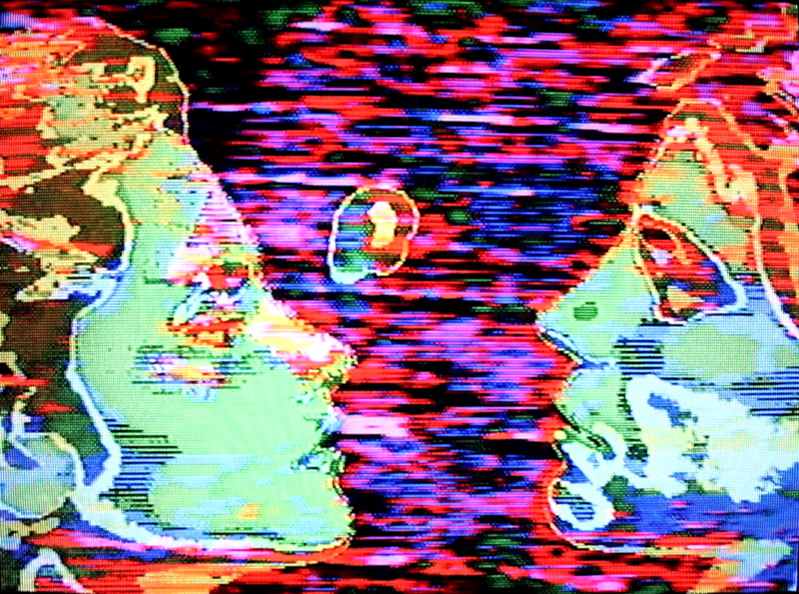
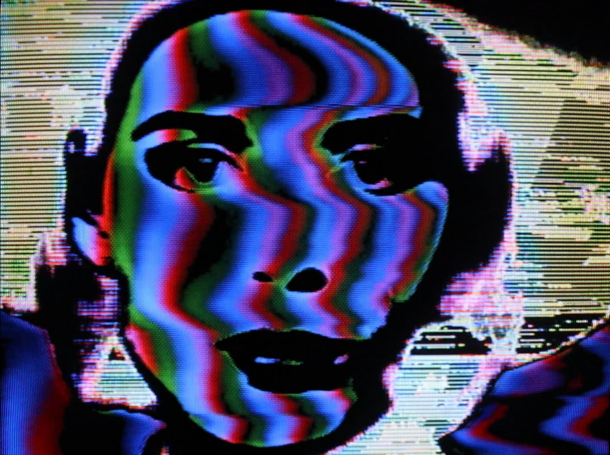
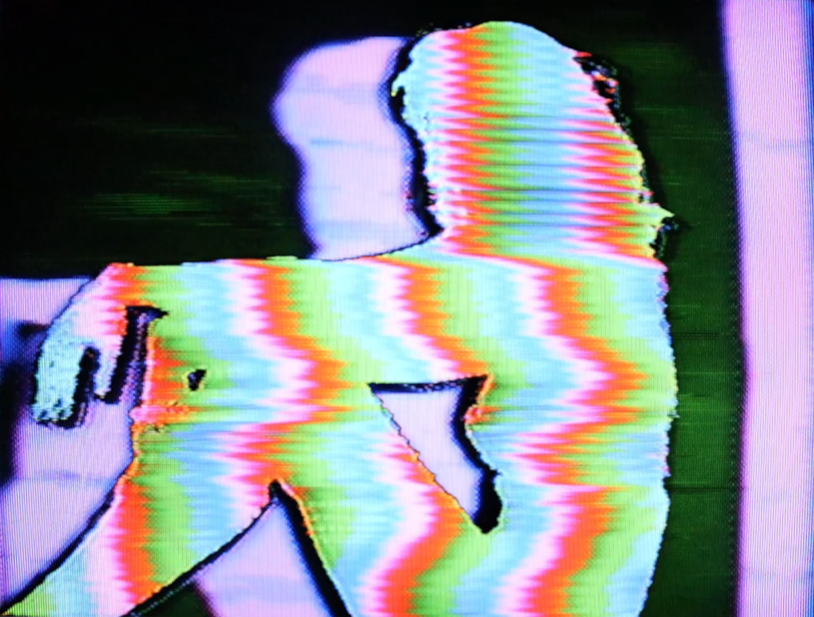
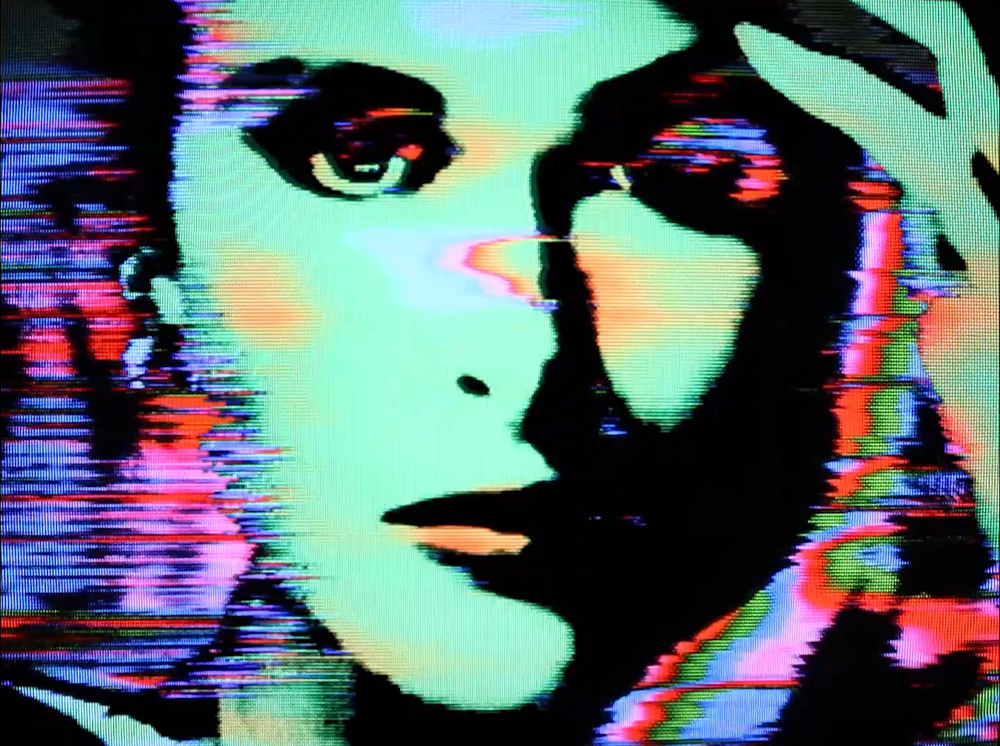

Videodrome TV is an analog video editor and visual artist from Virginia. After collecting and trading VHS since the mid 90s, they began sourcing and creating video art in 2018. At first, they started to combine vaporwaze and lofi music to create a sort-of nostalgic and comforting aesthetic to old commercials from around the world. During the pandemic, they found themselves streaming live glitch art weekly, and eventually inspired them to collaborate with musical artists, opening the door to an endless expanse of opportunities. After the pandemic, they began to work with musicians on stage for live shows.

<!--truncate-->

## Process

The first part in starting a project is sourcing videos and images. Videodrome spends hours sourcing through their archive of VHS tapes to find the perfect clips to capture the song. “With the use of dual VCRs, I will punch edit the VHS tape to the beat of the track while looping the audio through an analog mixer. As the tape loops and syncs, I run the source to multiple analog video mixers ranging from basic enhancers to modified mixers from the glitch art world community”. Videodrome then sends the signal to their 8 CRT walled display, projecting to a crowd or camera rescanning for video capture.

## Looking Ahead

Currently, Videodrome has been working on a music video for the minimal-synth group "Tiny Music", featuring camcorder footage of the band interlaced with aesthetic soda ads from the 1980s. As the year unfolds, Videodrome hopes to perform live both locally and abroad, experimenting with new video gear created by the glitch community.

