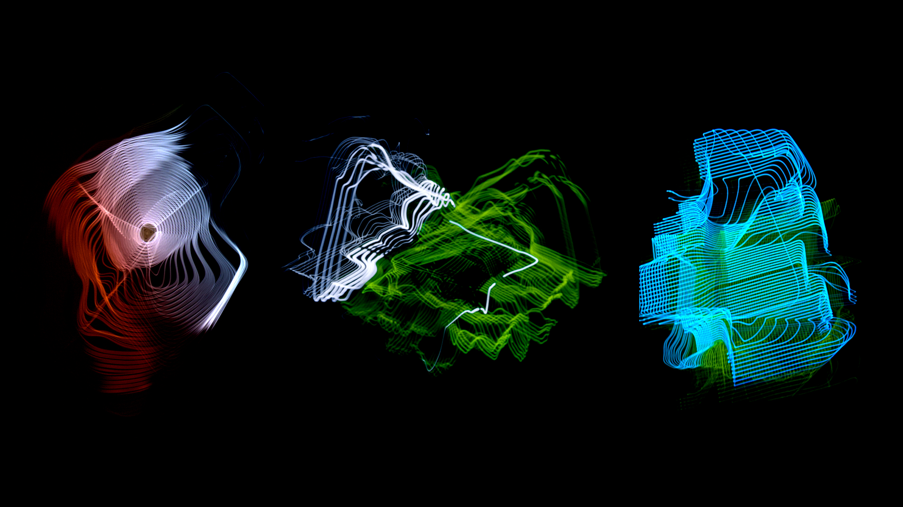
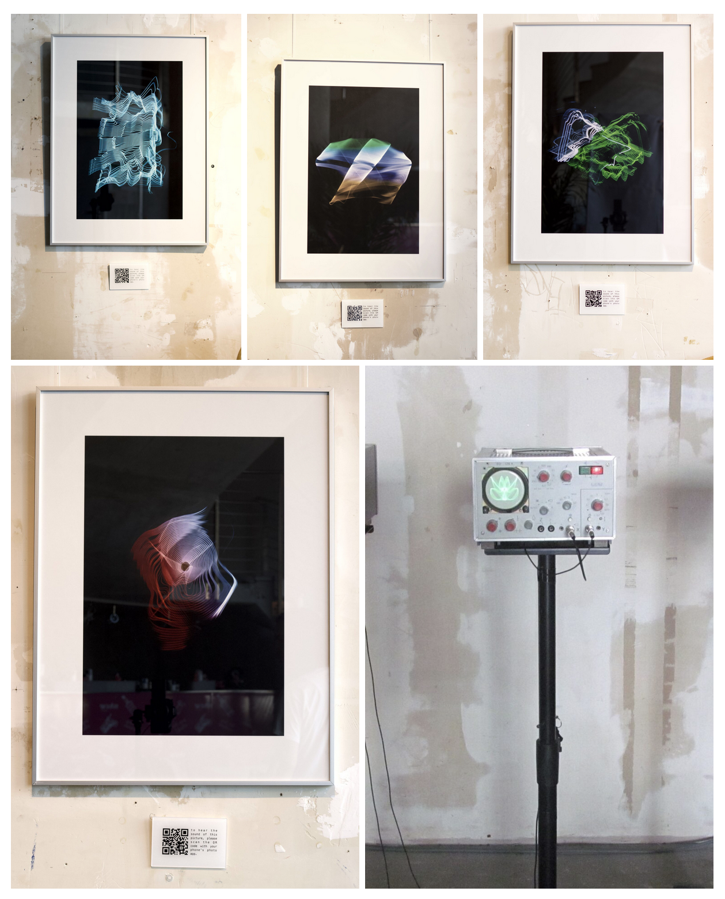
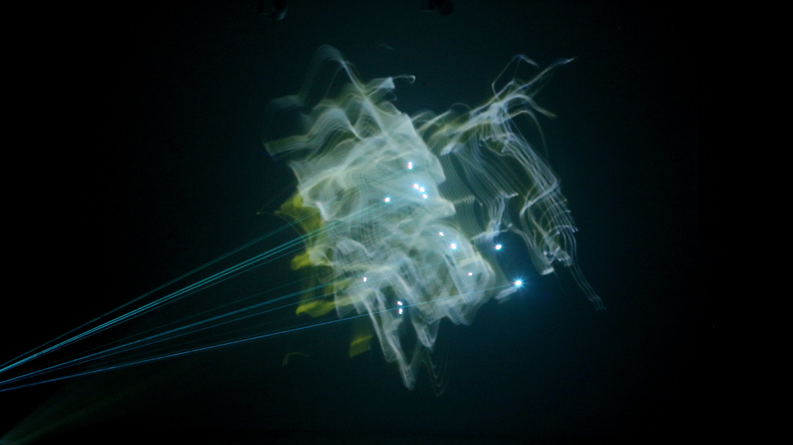
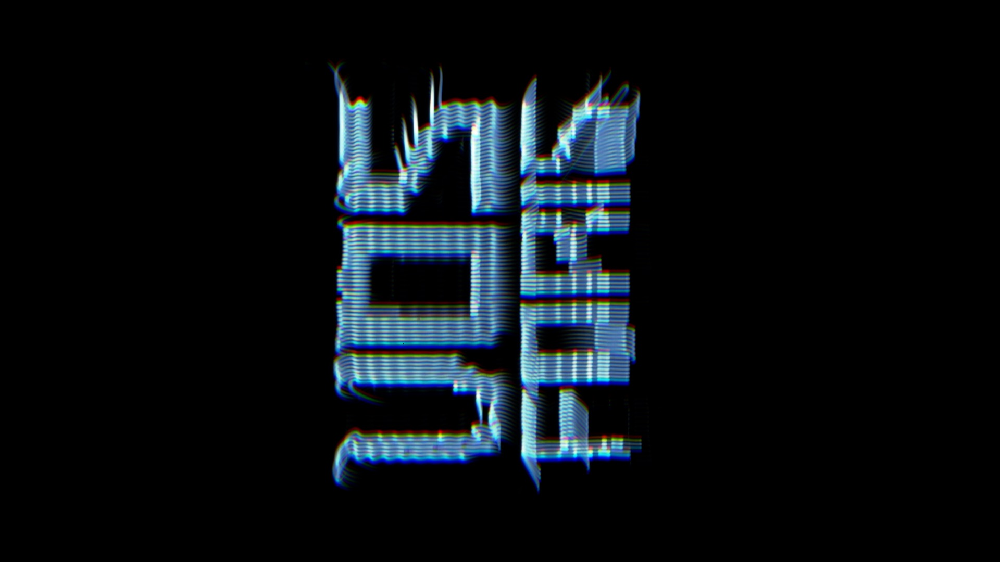
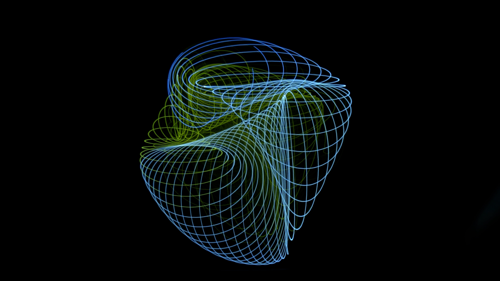

Sascha Bachmann is a musician and video artist who experiments with tape loops. As a musician going by the name HAND, he became fascinated with the properties of frequencies, and soon became familiar with the concept that sound is not only something we hear, but something that can also be seen and experienced spatially. “This curiosity eventually led me into the world of vector synthesis and analogue video techniques”.

<!--truncate-->

Soon enough, Sascha began experimenting with oscilloscopes, analogue monitors, audiovisual systems, fascinated that audio signals could generate moving images in real time. Over time, his practice began to combine music, technology, light, installation, and performance to create a larger artistic vision. A notable turning point was his development of the “HEARWHATYOUSEE” project, with its purpose to explore how frequencies could join the physical plane through photography, moving image, and live audiovisual performance. “What excites me most about video art is the intersection between precision and unpredictability. Working with analogue systems means that accidents and imperfections often become part of the final work. This creates a very human and physical quality that I feel is often missing from purely digital media”.

## Background

Sascha Bachmann’s process begins with a thought, an idea, a concept. Using this as his vision, he begins to build systems that can translate the idea into reality, using vector synthesis, oscilloscopes, analogue displays, and software environments such as Pure Data, Max/MSP, and Cyclops. Working in layers, he starts with the abstract to later compose them into his desired structure. “I enjoy filming directly from CRT or vector monitors because the imperfections, phosphor glow, and physicality of the screen add character that cannot easily be replicated digitally”. Sascha also finds that collaborative work is often essential to his process, offering a fresh perspective and ideas he couldn’t have conceptualized on his own.

## Process

Currently, he is working on expanding the HEARWHATYOUSEE through new installations & collaborations, working with a XY plotter to explore generative visuals, combining vector synthesis aesthetics, oscilloscopic imagery, and generative systems. “What interests me most is how these systems create imperfections, rhythm, and texture through mechanical movement, making every piece feel alive and unique”.

## Looking Ahead

This year, Sascha hopes to create larger immersive experiences providing the experience to physically enter the world of sound. “I see this year as a phase of expansion — both conceptually and spatially. More than anything, I want to continue creating work that invites people to slow down, observe frequencies differently, and experience the invisible structures of sound as something emotional, physical, and immersive”.

